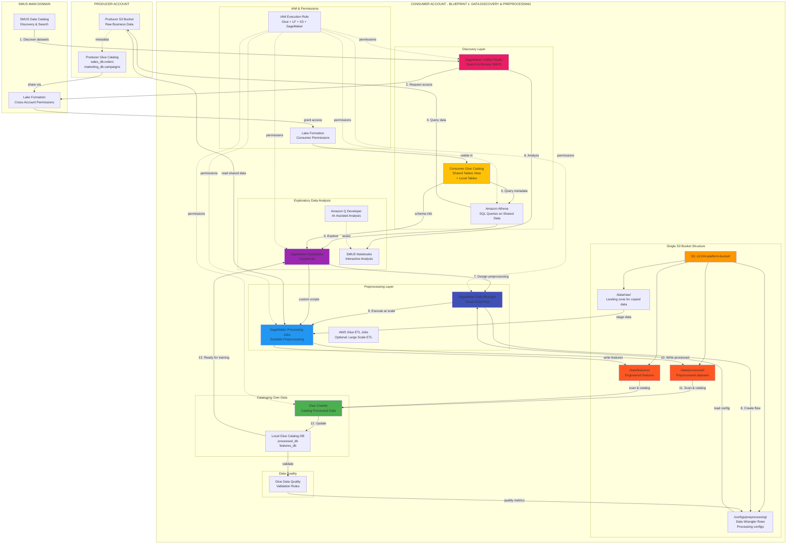

# AWS Glue Data Catalog - Complete Overview

## 1. **Is Glue Catalog Present by Default?**

### ✅ **YES - It exists by default in every AWS account**

**Key Points:**
- **Automatically available** - No setup or provisioning needed
- **Region-specific** - Each AWS region has its own Glue Catalog
- **Empty by default** - Contains no databases/tables until you create them
- **No cost when empty** - Only pay when you store metadata

**Think of it like:**
```
Every AWS Account = Empty house with rooms ready
Glue Catalog = Empty bookshelf already installed in each room (region)
You just need to add books (databases/tables)
```

---

## 2. **Is it an AWS Service? Managed or Serverless?**

### **AWS Service Type:**

| Aspect | Answer |
|--------|--------|
| **AWS Service?** | ✅ Yes - Fully managed AWS service |
| **Managed or Serverless?** | **100% Serverless** |
| **Infrastructure to manage?** | ❌ None - AWS handles everything |
| **Scaling?** | Automatic - no capacity planning |
| **High Availability?** | Built-in across AZs |
| **Pricing Model** | Pay per use (storage + API calls) |

### **Serverless Characteristics:**

```
✅ No servers to provision
✅ No capacity planning
✅ No maintenance windows
✅ No patching required
✅ Automatic scaling
✅ Pay only for:
   - Metadata storage ($1/100,000 objects/month)
   - API requests ($1/million requests)
```

---

## 3. **Glue Catalog in Consumer Accounts for Blueprints**

### **Question: Do consumer accounts need their own Glue Catalog for blueprints?**

### ✅ **YES - They automatically have one, and YES - You need to use it**

### **Why Consumers Need Glue Catalog:**

 **Consumer Glue Catalog Usage:**
```mermaid
graph TB
    subgraph "Producer Account P"
        S3P[S3 Data Bucket]
        GCP[Glue Catalog P<br/>Database: sales_db<br/>Table: orders]
        
        S3P -->|metadata| GCP
    end
    
    subgraph "Main SMUS Domain M"
        SMUS[SMUS Catalog<br/>Aggregator]
        LFM[Lake Formation M<br/>Permission Manager]
    end
    
    subgraph "Consumer Account C - YOUR BLUEPRINT"
        GCC[Glue Catalog C<br/>CRITICAL COMPONENT]
        
        subgraph "Blueprint Components Need Glue"
            ATH[Athena<br/>Queries shared tables]
            DW[Data Wrangler<br/>Reads schemas]
            EMR[EMR/Glue Jobs<br/>Process data]
            NB[SageMaker Notebooks<br/>Access metadata]
        end
        
        GCC -.->|Provides schema| ATH
        GCC -.->|Table metadata| DW
        GCC -.->|Catalog access| EMR
        GCC -.->|Query metadata| NB
    end
    
    GCP -->|Share via LF| LFM
    SMUS -.->|Discovery| LFM
    LFM -->|Grant access| GCC
    
    ATH -->|Read data| S3P
    DW -->|Read data| S3P
    EMR -->|Process data| S3P
    
    style GCC fill:#FF6B6B
    style ATH fill:#4ECDC4
    style DW fill:#95E1D3
    style EMR fill:#FFC107
    style NB fill:#B39DDB

  ```

#### **Scenario 1: Accessing Shared Producer Data**

```
Producer Account P:
├── S3: s3://producer-bucket/sales/
└── Glue Catalog: sales_db.orders (metadata)
        ↓ (shared via Lake Formation)
Consumer Account C:
├── Glue Catalog: Shows "sales_db.orders" as SHARED
│   └── This is just a REFERENCE, not a copy
└── Your Blueprint Components:
    ├── Athena → Reads from Consumer Glue Catalog
    ├── Data Wrangler → Reads from Consumer Glue Catalog
    └── SageMaker Training → Queries via Consumer Glue Catalog
```

**Key Point:** When producer shares their catalog, it **appears in the consumer's Glue Catalog** as shared tables. The consumer's tools (Athena, Data Wrangler, etc.) query the **consumer's local Glue Catalog view**, which includes both:
1. Local tables (consumer's own data)
2. Shared tables (producer's data - read-only reference)

#### **Scenario 2: Consumer's Own Data**

```
Consumer Account C:
├── S3: s3://consumer-bucket/experiments/
├── Glue Catalog: 
│   ├── LOCAL databases:
│   │   └── my_experiments_db.feature_table
│   └── SHARED databases (from producers):
│       └── sales_db.orders (read-only)
└── Blueprint uses BOTH in training/inference
```

---

## 4. **Blueprint Design Considerations**

### **Do You Need to "Create" Glue Catalog in Blueprints?**

### ❌ **NO - Don't create it (it already exists)**
### ✅ **YES - Reference and use it in your blueprints**

### **Blueprint Architecture Pattern:**

```yaml
# Blueprint Definition (CloudFormation/CDK)

# ❌ DON'T DO THIS - Glue Catalog already exists
# AWS::Glue::Catalog  # <-- This resource doesn't exist!

# ✅ DO THIS - Just reference it in your resources

Resources:
  # Athena Workgroup references Glue Catalog
  AthenaWorkgroup:
    Type: AWS::Athena::WorkGroup
    Properties:
      # Athena automatically uses account's Glue Catalog
      # No explicit catalog configuration needed
  
  # Data Wrangler Flow references Glue Catalog
  DataWranglerFlow:
    # Connects to Glue Catalog automatically
    # Uses boto3.client('glue') in processing scripts
  
  # SageMaker Training Job
  TrainingJob:
    Properties:
      # Can query Glue Catalog via Athena/Spark
      # Access through IAM permissions only
```

### **What You NEED in Blueprint:**

```yaml
# 1. IAM Permissions for Glue Catalog Access
GlueCatalogPolicy:
  Type: AWS::IAM::Policy
  Properties:
    PolicyDocument:
      Statement:
        - Effect: Allow
          Action:
            - glue:GetDatabase
            - glue:GetDatabases
            - glue:GetTable
            - glue:GetTables
            - glue:GetPartitions
          Resource: "*"

# 2. Lake Formation Permissions (for shared data)
LakeFormationPermissions:
  Type: AWS::LakeFormation::PrincipalPermissions
  Properties:
    Permissions:
      - SELECT
    Resource:
      Table:
        DatabaseName: sales_db  # Shared database
        Name: orders

# 3. S3 Access (to read actual data)
S3DataAccessPolicy:
  Type: AWS::IAM::Policy
  Properties:
    PolicyDocument:
      Statement:
        - Effect: Allow
          Action:
            - s3:GetObject
            - s3:ListBucket
          Resource:
            - arn:aws:s3:::producer-bucket/*
            - arn:aws:s3:::consumer-bucket/*
```

---

## 5. **Glue Crawlers - Same Questions**

### **Is Glue Crawler available by default?**

### ✅ **YES - Service available, but NO crawlers exist by default**

**Key Distinctions:**

| Aspect | Glue Data Catalog | Glue Crawlers |
|--------|-------------------|---------------|
| **Exists by default?** | ✅ Catalog structure exists | ❌ No crawlers exist |
| **Need to create?** | ❌ No, use existing | ✅ Yes, must create explicitly |
| **Serverless?** | ✅ Yes | ✅ Yes |
| **Managed?** | ✅ Fully managed | ✅ Fully managed |
| **Cost when idle?** | ✅ Free (empty catalog) | ✅ Free (no crawlers) |
| **Cost when active?** | Per object stored | Per DPU-hour when running |

### **Glue Crawler Characteristics:**

```
Glue Crawler = Serverless ETL job that:
├── Scans S3 buckets
├── Infers schema automatically
├── Creates/updates Glue Catalog tables
├── Runs on-demand or scheduled
└── Fully serverless (no infrastructure)
```

### **Pricing:**
- **$0.44 per DPU-hour** (Data Processing Unit)
- Typically uses 2-10 DPUs depending on data size
- Only charged when crawler runs
- Example: Crawling 1TB might cost $1-5

---

## 6. **Do You Need Glue Crawlers in Consumer Account for Blueprints?**

### **Answer: IT DEPENDS on your use case**

### **Scenario Analysis:**

#### **Scenario A: Consumer ONLY uses shared producer data**

```
Consumer Account C:
└── Accessing sales_db.orders (shared from Producer)
    └── Schema already defined by Producer's crawler
    └── Consumer Glue Catalog shows it as reference
    
✅ NO CRAWLER NEEDED
   - Producer already crawled their data
   - Schema metadata is shared
   - Consumer just queries it
```

#### **Scenario B: Consumer has their OWN data to catalog**

```
Consumer Account C:
├── s3://consumer-bucket/ml-features/
│   ├── feature_v1.parquet
│   └── feature_v2.parquet
└── Need to catalog this data for training

✅ CRAWLER NEEDED
   - Consumer must crawl their own S3 data
   - Creates tables in consumer's Glue Catalog
   - Used alongside shared producer data
```

#### **Scenario C: Consumer processes and stores results**

```
Consumer Blueprint Flow:
1. Read from shared sales_db.orders (Producer data)
2. Process with SageMaker/Glue
3. Write results to s3://consumer-bucket/processed/
4. Need to catalog processed results

✅ CRAWLER NEEDED
   - Catalog the processed/transformed data
   - Make results queryable via Athena
   - Track output datasets
```

---

## 7. **Blueprint Design Patterns**

### **Pattern 1: Read-Only Consumer (No Crawler)**

```yaml
# Use Case: Only query shared data, no data generation

Blueprint Components:
  ├── IAM Role (Glue + LakeFormation + S3 read permissions)
  ├── Athena Workgroup
  ├── SageMaker Endpoint (uses shared data for inference)
  └── NO Glue Crawler needed

User Workflow:
  1. Query shared data via Athena
  2. Train model on shared data
  3. Deploy model for inference
  4. No new data to catalog
```

### **Pattern 2: Producer-Consumer (Needs Crawler)**

```yaml
# Use Case: Read shared data + Create new datasets

Blueprint Components:
  ├── IAM Role (Glue + LakeFormation + S3 read/write)
  ├── Athena Workgroup
  ├── Glue Crawler (scheduled)
  ├── S3 Bucket (for processed data)
  └── SageMaker Training/Processing

User Workflow:
  1. Query shared sales data
  2. Process and create features
  3. Store features in S3
  4. Glue Crawler catalogs features → ✅ CRAWLER HERE
  5. Other team members query cataloged features
```

### **Pattern 3: Full Data Platform (Multiple Crawlers)**

```yaml
# Use Case: Complex data pipelines

Blueprint Components:
  ├── Glue Crawler 1: Raw data ingestion
  ├── Glue ETL Jobs: Transform data
  ├── Glue Crawler 2: Catalog transformed data
  ├── Glue Crawler 3: Catalog ML features
  └── Feature Store

Glue Catalog Structure:
  ├── raw_db (crawled by Crawler 1)
  ├── processed_db (crawled by Crawler 2)
  ├── features_db (crawled by Crawler 3)
  └── shared_db (from Producer - no local crawler)
```

---

## 8. **Blueprint Creation Decision Matrix**


### **Quick Answers:**

1. **Glue Catalog exists by default?**
   - ✅ YES - In every AWS account, every region
   - Empty until you populate it
   - No setup or creation needed

2. **AWS Service type?**
   - ✅ Fully managed AWS service
   - 100% serverless
   - Auto-scaling, no infrastructure

3. **Need Glue Catalog in consumer blueprints?**
   - ✅ YES - But it already exists!
   - Just add **IAM permissions** to access it
   - Don't create it (can't and shouldn't)
   - Use it to:
     - Query shared producer data
     - Catalog consumer's own data

4. **Glue Crawlers by default?**
   - ❌ NO crawlers exist by default
   - ✅ YES, crawler service is available
   - Must create explicitly when needed

5. **Need Crawlers in consumer blueprints?**
   - **If only reading shared data:** ❌ NO
   - **If generating new datasets:** ✅ YES
   - **If doing inference only:** ❌ NO
   - **If processing and storing results:** ✅ YES

### **Blueprint Design Rule:**

```
Include in ALL blueprints:
✅ Glue Catalog IAM permissions (read existing catalog)

Include CONDITIONALLY:
⚠️ Glue Crawler (only if blueprint generates data to catalog)
```


----------------------------------------------

```mermaid
graph TB
    subgraph "SHARED INFRASTRUCTURE - Used by ALL Inference Blueprints"
        subgraph "Single S3 Bucket - Unified Structure"
            S3ROOT[S3: s3://ml-platform-bucket/<br/>SINGLE BUCKET FOR EVERYTHING]
            
            S3DATA[/data/<br/>├── raw/<br/>├── processed/<br/>└── features/]
            
            S3ARTIFACTS[/artifacts/<br/>├── models/<br/>│   ├── bedrock-customized/<br/>│   ├── sagemaker-finetuned/<br/>│   └── sagemaker-custom/<br/>├── training-outputs/<br/>└── checkpoints/]
            
            S3INFERENCE[/inference/<br/>├── realtime/<br/>│   └── logs/<br/>├── serverless/<br/>│   └── logs/<br/>├── batch/<br/>│   ├── input/<br/>│   └── output/<br/>└── async/<br/>    ├── input/<br/>    ├── output/<br/>    └── failures/]
            
            S3CONFIGS[/configs/<br/>├── preprocessing/<br/>├── training/<br/>└── inference/<br/>    ├── realtime/<br/>    ├── serverless/<br/>    ├── batch/<br/>    └── async/]
            
            S3LOGS[/logs/<br/>├── preprocessing/<br/>├── training/<br/>└── inference/<br/>    ├── realtime/<br/>    ├── serverless/<br/>    ├── batch/<br/>    └── async/]
            
            S3ROOT --> S3DATA
            S3ROOT --> S3ARTIFACTS
            S3ROOT --> S3INFERENCE
            S3ROOT --> S3CONFIGS
            S3ROOT --> S3LOGS
        end
        
        subgraph "Shared Model Registry"
            MR[SageMaker Model Registry<br/>━━━━━━━━━━━━━━━━━━<br/>Centralized model versions<br/>Approval workflows<br/>Model lineage<br/>Deployment history]
            
            MR_PROD[Production Models<br/>Approved for all endpoints]
            MR_STAGE[Staging Models<br/>Testing phase]
            MR_ARCH[Archived Models<br/>Previous versions]
            
            MR --> MR_PROD
            MR --> MR_STAGE
            MR --> MR_ARCH
        end
        
        subgraph "Shared Model Sources"
            BR[Amazon Bedrock<br/>━━━━━━━━━━━━━━━━━━<br/>Foundation Models<br/>Claude, Llama, Titan, etc.]
            
            BR_BASE[Base Models<br/>On-demand API access]
            BR_CUSTOM[Customized Models<br/>Continued pre-training]
            BR_FINE[Fine-tuned Models<br/>Provisioned throughput]
            
            BR --> BR_BASE
            BR --> BR_CUSTOM
            BR --> BR_FINE
            
            SM_MODELS[SageMaker Models<br/>From S3 artifacts]
        end
        
        subgraph "Shared API Gateway"
            APIGW_SHARED[API Gateway<br/>━━━━━━━━━━━━━━━━━━<br/>Unified API for all methods]
            
            APIGW_ROUTES[Route Configuration<br/>━━━━━━━━━━━━━━━━━━<br/>/realtime → Real-time Lambda<br/>/serverless → Serverless Lambda<br/>/batch → Batch Lambda<br/>/async → Async Lambda]
            
            APIGW_AUTH[Authentication<br/>API Keys, IAM, Cognito]
            APIGW_THROTTLE[Throttling & Quotas<br/>Rate limiting]
            
            APIGW_SHARED --> APIGW_ROUTES
            APIGW_SHARED --> APIGW_AUTH
            APIGW_SHARED --> APIGW_THROTTLE
        end
        
        subgraph "Shared Lambda Functions"
            LAMBDA_ROUTER[Lambda: Model Router<br/>━━━━━━━━━━━━━━━━━━<br/>Intelligent routing logic<br/>Choose: Bedrock vs SageMaker<br/>Load balancing<br/>Failover logic]
            
            LAMBDA_PRE[Lambda: Preprocessor<br/>Common preprocessing<br/>Data validation<br/>Format conversion]
            
            LAMBDA_POST[Lambda: Postprocessor<br/>Response formatting<br/>Error handling<br/>Logging]
        end
        
        subgraph "Shared Monitoring Stack"
            CW_UNIFIED[CloudWatch - Unified Dashboard<br/>━━━━━━━━━━━━━━━━━━<br/>All inference metrics<br/>Cross-method comparison<br/>Cost tracking]
            
            CW_ALARMS[CloudWatch Alarms<br/>━━━━━━━━━━━━━━━━━━<br/>High latency alerts<br/>Error rate alerts<br/>Cost threshold alerts]
            
            CW_LOGS_CENTRAL[CloudWatch Logs<br/>━━━━━━━━━━━━━━━━━━<br/>Centralized logging<br/>Log groups per method<br/>Cross-method correlation]
            
            XRAY_UNIFIED[AWS X-Ray<br/>━━━━━━━━━━━━━━━━━━<br/>End-to-end tracing<br/>Service map<br/>Performance bottlenecks]
            
            CW_UNIFIED --> CW_ALARMS
            CW_UNIFIED --> CW_LOGS_CENTRAL
        end
        
        subgraph "Shared Model Monitoring"
            MM[SageMaker Model Monitor<br/>━━━━━━━━━━━━━━━━━━<br/>Works across endpoints]
            
            MM_DATA[Data Quality Monitor<br/>Input data drift]
            MM_MODEL[Model Quality Monitor<br/>Prediction accuracy]
            MM_BIAS[Bias Monitor<br/>Fairness metrics]
            
            MM --> MM_DATA
            MM --> MM_MODEL
            MM --> MM_BIAS
        end
        
        subgraph "Shared IAM Roles"
            IAM_BASE[Base Execution Role<br/>━━━━━━━━━━━━━━━━━━<br/>Common permissions<br/>S3, CloudWatch, ECR]
            
            IAM_REALTIME[Real-time Endpoint Role<br/>+ Endpoint invocation]
            IAM_SERVERLESS[Serverless Endpoint Role<br/>+ Serverless policies]
            IAM_BATCH[Batch Transform Role<br/>+ Large S3 access]
            IAM_ASYNC[Async Endpoint Role<br/>+ SNS publish]
            
            IAM_BASE --> IAM_REALTIME
            IAM_BASE --> IAM_SERVERLESS
            IAM_BASE --> IAM_BATCH
            IAM_BASE --> IAM_ASYNC
        end
        
        subgraph "Shared Security"
            VPC[VPC Configuration<br/>━━━━━━━━━━━━━━━━━━<br/>Private subnets<br/>Security groups<br/>VPC endpoints]
            
            KMS_KEY[KMS Master Key<br/>━━━━━━━━━━━━━━━━━━<br/>Encrypt models<br/>Encrypt data<br/>Encrypt logs]
            
            WAF_SHARED[AWS WAF<br/>━━━━━━━━━━━━━━━━━━<br/>Shared rules<br/>API protection<br/>DDoS mitigation]
        end
        
        subgraph "Shared Event System"
            EB[EventBridge<br/>━━━━━━━━━━━━━━━━━━<br/>Event bus for all methods]
            
            EB_RULES[Event Rules<br/>━━━━━━━━━━━━━━━━━━<br/>Model updates → Redeploy<br/>Data drift → Alert<br/>Job completion → Notify]
            
            SNS_CENTRAL[SNS Central Topic<br/>━━━━━━━━━━━━━━━━━━<br/>Unified notifications<br/>Admin alerts<br/>System events]
            
            EB --> EB_RULES
            EB_RULES --> SNS_CENTRAL
        end
        
        subgraph "Cost Management"
            COST[AWS Cost Explorer<br/>━━━━━━━━━━━━━━━━━━<br/>Track inference costs<br/>Per-method breakdown<br/>Optimization recommendations]
            
            BUDGET[AWS Budgets<br/>━━━━━━━━━━━━━━━━━━<br/>Set spending limits<br/>Alert on overruns]
        end
    end
    
    subgraph "Blueprint Usage Patterns"
        BP_RT[Blueprint 3a: Real-time<br/>Uses: MR + APIGW + CW + MM]
        BP_SL[Blueprint 3b: Serverless<br/>Uses: MR + APIGW + CW + MM]
        BP_BATCH[Blueprint 3c: Batch<br/>Uses: MR + EB + CW]
        BP_ASYNC[Blueprint 3d: Async<br/>Uses: MR + APIGW + SNS + CW + MM]
    end
    
    S3ROOT -.->|ALL blueprints| BP_RT
    S3ROOT -.->|ALL blueprints| BP_SL
    S3ROOT -.->|ALL blueprints| BP_BATCH
    S3ROOT -.->|ALL blueprints| BP_ASYNC
    
    MR -.->|shared| BP_RT
    MR -.->|shared| BP_SL
    MR -.->|shared| BP_BATCH
    MR -.->|shared| BP_ASYNC
    
    BR -.->|available to all| BP_RT
    BR -.->|available to all| BP_SL
    BR -.->|available to all| BP_BATCH
    BR -.->|available to all| BP_ASYNC
    
    APIGW_SHARED -.->|routes to| BP_RT
    APIGW_SHARED -.->|routes to| BP_SL
    APIGW_SHARED -.->|routes to| BP_ASYNC
    
    CW_UNIFIED -.->|monitors all| BP_RT
    CW_UNIFIED -.->|monitors all| BP_SL
    CW_UNIFIED -.->|monitors all| BP_BATCH
    CW_UNIFIED -.->|monitors all| BP_ASYNC
    
    style S3ROOT fill:#FF9800
    style MR fill:#4CAF50
    style BR fill:#FF6B6B
    style APIGW_SHARED fill:#9C27B0
    style CW_UNIFIED fill:#2196F3
    style MM fill:#00BCD4
    style KMS_KEY fill:#795548
    style EB fill:#FF5722
    style BP_RT fill:#E1BEE7
    style BP_SL fill:#B39DDB
    style BP_BATCH fill:#9575CD
    style BP_ASYNC fill:#7E57C2
```








# Complete Blueprint Architecture Summary

## Overview: End-to-End Gen AI Platform

This architecture provides a complete, production-ready Gen AI platform with 6 blueprints covering the entire ML lifecycle:

### Blueprint Sequence
```
1. Data Discovery & Preprocessing
   ↓
2. Model Training & Fine-tuning
   ↓
3a. Real-time Inference
3b. Serverless Inference
3c. Batch Inference
3d. Async Inference
```

---

## Single S3 Bucket Strategy - Complete Structure

### **S3 Bucket: `s3://ml-platform-bucket/`**

```
s3://ml-platform-bucket/
│
├── data/                           # All data assets
│   ├── raw/                        # Landing zone, copied from shared sources
│   ├── processed/                  # Preprocessed datasets ready for training
│   └── features/                   # Engineered features
│
├── artifacts/                      # All ML artifacts
│   ├── models/                     # Model artifacts (ALL methods use this)
│   │   ├── bedrock-customized/     # Bedrock customized models metadata
│   │   ├── sagemaker-finetuned/    # Fine-tuned models
│   │   │   ├── model-v1/
│   │   │   │   ├── model.tar.gz
│   │   │   │   └── config.json
│   │   │   └── model-v2/
│   │   └── sagemaker-custom/       # Custom architectures
│   ├── training-outputs/           # Training logs, metrics
│   └── checkpoints/                # Training checkpoints
│
├── inference/                      # Inference-specific data
│   ├── realtime/
│   │   └── logs/                   # Real-time request logs (if enabled)
│   ├── serverless/
│   │   └── logs/                   # Serverless request logs
│   ├── batch/
│   │   ├── input/                  # Batch input datasets
│   │   │   ├── customers-2024.csv
│   │   │   └── reviews-batch-1.jsonl
│   │   └── output/                 # Batch prediction results
│   │       ├── customers-2024.out
│   │       └── reviews-batch-1.out
│   └── async/
│       ├── input/                  # Individual async request payloads
│       │   ├── request-001.pdf
│       │   └── request-002.json
│       ├── output/                 # Async prediction results
│       │   ├── result-001.json
│       │   └── result-002.json
│       └── failures/               # Failed async requests
│
├── configs/                        # All configuration files
│   ├── preprocessing/
│   │   ├── data-wrangler-flow-1.json
│   │   └── processing-config.yaml
│   ├── training/
│   │   ├── hyperparameters.json
│   │   ├── training-config.yaml
│   │   └── model-config.json
│   └── inference/
│       ├── realtime/
│       │   ├── endpoint-config-prod.json
│       │   └── autoscaling-policy.json
│       ├── serverless/
│       │   └── serverless-config.json
│       ├── batch/
│       │   └── transform-config.json
│       └── async/
│           ├── async-config.json
│           └── notification-config.json
│
└── logs/                           # Centralized logging
    ├── preprocessing/
    ├── training/
    └── inference/
        ├── realtime/
        ├── serverless/
        ├── batch/
        └── async/
```

---

## Blueprint 1: Data Discovery & Preprocessing

### **Purpose**
Access shared data from SMUS catalog, perform exploratory analysis, preprocess data, and prepare datasets for training.

### **Key Components**
| Component | Purpose | Notes |
|-----------|---------|-------|
| SMUS Studio | Discover datasets from catalog | Access shared producer data |
| Consumer Glue Catalog | View shared tables + local tables | Automatically includes shared metadata |
| Amazon Athena | SQL queries on shared data | Read directly from producer S3 |
| SageMaker Notebooks | Interactive EDA | JupyterLab environment |
| Data Wrangler | Visual data preparation | No-code transformations |
| SageMaker Processing | Scalable preprocessing at scale | Distributed processing |
| Glue Crawler | **Catalog preprocessed data** | Makes processed data queryable |
| Glue Data Quality | Validation rules | Ensure data quality |

### **Outputs to S3**
- `/data/processed/` - Preprocessed datasets
- `/data/features/` - Engineered features  
- `/configs/preprocessing/` - Data Wrangler flows

### **Glue Catalog**
✅ **Need Glue Crawler**: YES - To catalog processed data for downstream use

---

## Blueprint 2: Model Training & Fine-tuning

### **Purpose**
Load preprocessed data, select foundation models, fine-tune with various strategies, and register trained models.

### **SageMaker AI Components Required**

| Component | Purpose | Configuration |
|-----------|---------|---------------|
| **SageMaker Training Jobs** | Execute training | Instance: ml.g5.2xlarge-48xlarge |
| **Managed Spot Training** | Cost optimization | Save up to 90% on training |
| **Hyperparameter Tuning** | Automatic optimization | Bayesian optimization |
| **SageMaker Experiments** | Track runs & metrics | Automatic lineage tracking |
| **SageMaker Debugger** | Monitor training | Real-time debugging |
| **Model Registry** | Version control & approval | Central model repository |
| **SageMaker Pipelines** | Orchestrate training workflow | End-to-end automation |
| **Feature Store** | Manage features | Online + Offline store |
| **SageMaker JumpStart** | Pre-trained models | Llama, Falcon, Mistral |
| **Amazon ECR** | Container images | Custom training containers |
| **Deep Learning Containers** | Pre-built environments | PyTorch, TensorFlow, Hugging Face |

### **Training Strategies Supported**
1. **Full Fine-tuning** - Complete model retraining
2. **LoRA/QLoRA** - Parameter-efficient fine-tuning (PEFT)
3. **Prompt Tuning** - Soft prompt optimization

### **Model Sources**
- SageMaker JumpStart (pre-trained models)
- Hugging Face Hub (open source models)
- Bedrock base models (for comparison)

### **Outputs to S3**
- `/artifacts/models/sagemaker-finetuned/` - Trained model artifacts
- `/artifacts/training-outputs/` - Logs, metrics
- `/artifacts/checkpoints/` - Training checkpoints
- `/configs/training/` - Training configurations

### **Model Registry**
✅ Models registered with approval workflow
✅ Version control and lineage tracking
✅ Ready for deployment to ANY inference method

---

## Blueprint 3a: Real-time Inference

### **Purpose**
Low-latency inference for interactive applications (< 1 second response time).

### **Architecture Pattern**
```
Client → API Gateway → Lambda → [Bedrock API OR SageMaker Endpoint] → Response
```

### **Key Components**
| Component | Purpose | Configuration |
|-----------|---------|---------------|
| API Gateway | Request routing | REST API with throttling |
| Lambda | Model routing logic | Choose Bedrock vs SageMaker |
| **Bedrock API** | Foundation model inference | Pay-per-token, instant |
| **SageMaker Real-time Endpoint** | Custom model inference | Always-on, auto-scaling |
| Auto-scaling | Scale instances | Based on traffic |
| Model Monitor | Data drift detection | Quality tracking |
| CloudWatch | Metrics & alarms | Performance monitoring |
| X-Ray | Distributed tracing | Latency analysis |

### **Advanced Features**
- **Multi-model endpoints** - Deploy multiple models on one endpoint
- **A/B testing** - Traffic splitting between model versions
- **Shadow mode** - Test new models without affecting production

### **When to Use**
- Interactive applications (chatbots, web apps)
- Need < 1 second response time
- Unpredictable traffic patterns
- Real-time decision making

### **Glue Catalog**
❌ **No Crawler Needed** - Just inference, no data cataloging

---

## Blueprint 3b: Serverless Inference

### **Purpose**
Cost-effective inference for sporadic/intermittent traffic with automatic scaling to zero.

### **Architecture Pattern**
```
Client → API Gateway → Lambda → [Bedrock API OR Serverless Endpoint] → Response
```

### **Key Components**
| Component | Purpose | Configuration |
|-----------|---------|---------------|
| **SageMaker Serverless Endpoint** | Auto-scaling inference | Memory: 1GB-6GB |
| Serverless Config | Max concurrency: 1-200 | Auto scale to zero |
| Bedrock API | Native serverless option | No cold start |

### **Key Characteristics**
- **Cold start**: 10-60 seconds on first request
- **Warm state**: Fast responses after first invoke
- **Scale to zero**: No cost when idle
- **Pay per inference second** + memory allocated

### **When to Use**
- Sporadic/intermittent traffic
- Development/testing environments  
- Cost-sensitive workloads
- Can tolerate cold starts

### **Pricing Model**
```
Cost = (Inference seconds × Memory MB × $0.000006944) + ($0.20 per 1M requests)
Example: 1000 requests/day × 5s × 2GB = ~$0.83/day
```

### **Glue Catalog**
❌ **No Crawler Needed** - Just inference

---

## Blueprint 3c: Batch Transform Inference

### **Purpose**
Process large datasets (thousands to millions of records) in parallel, most cost-effective for volume.

### **Architecture Pattern**
```
Client uploads dataset → EventBridge/Lambda triggers job → 
[Bedrock Batch OR Batch Transform] processes entire dataset → 
EventBridge notifies completion → Results in S3
```

### **Key Components**
| Component | Purpose | Configuration |
|-----------|---------|---------------|
| EventBridge | Job scheduling & completion | Trigger on schedule or S3 event |
| Lambda | Job submission | Create transform job |
| **Bedrock Batch** | Process up to 50K records | JSONL format only |
| **SageMaker Batch Transform** | Process any dataset size | CSV, JSON, Parquet |
| Glue Crawler | **Catalog results** | Make results queryable |

### **Batch Transform Phases**
1. **Initialization** (5-10 min): Spin up instances, load model
2. **Processing** (hours): Parallel processing of all records
3. **Finalization** (min): Aggregate results, terminate instances

### **Processing Strategies**
- **SingleRecord**: One record at a time
- **MultiRecord**: Batch multiple records (better throughput)

### **When to Use**
- Process 1,000+ records at once
- Scheduled/periodic inference (daily reports)
- Cost-sensitive large-scale processing
- Can wait hours for results

### **Cost Optimization**
```
Typical batch job: 10,000 records
Cost: $2-10 (vs $50-100 for real-time)
```

### **Glue Catalog**
✅ **Need Crawler**: YES - To catalog batch results for downstream analysis

---

## Blueprint 3d: Async Inference

### **Purpose**
Process individual large requests with long inference times (minutes to hours), with queue-based processing.

### **Architecture Pattern**
```
Client uploads to S3 → Invoke async endpoint with S3 path → 
Endpoint queues request → Worker processes → 
Result to S3 → SNS notification → Lambda callback → Client notified
```

### **Key Components**
| Component | Purpose | Configuration |
|-----------|---------|---------------|
| API Gateway + Lambda | Request submission | Return request ID immediately |
| **SageMaker Async Endpoint** | Queue-based processing | Max concurrent: 1-1000 |
| Internal Queue | FIFO processing | Automatic retries |
| SNS Topics | Success/failure notifications | Trigger callbacks |
| Lambda Callback | Process results | Notify client via webhook |
| Auto-scaling | Scale based on queue depth | Scale to 0 when idle |

### **Notification Flow**
```
Async Endpoint completes → SNS Success Topic → Lambda Callback →
[Webhook to client OR Email OR Update database]
```

### **When to Use**
- Large individual requests (100-page PDF analysis)
- Long inference times (5 min - 1 hour per request)
- Need immediate confirmation of submission
- Want notification on completion
- Sporadic large requests

### **vs Batch Transform**
| Aspect | Async | Batch |
|--------|-------|-------|
| Input | Individual files | Entire dataset |
| Processing | Request by request | All at once |
| Notification | Per request (SNS) | Per job (EventBridge) |
| Use case | One-off large requests | Bulk processing |

### **Glue Catalog**
❌ **No Crawler Needed** - Results are individual, not datasets

---

## Shared Infrastructure Components

### **Critical Shared Resources**

#### **1. Single S3 Bucket**
- ✅ ALL blueprints use the same bucket
- ✅ Organized folder structure prevents conflicts
- ✅ Centralized cost tracking
- ✅ Simplified permissions management

#### **2. Model Registry**
- ✅ Central repository for ALL models
- ✅ Used by real-time, serverless, batch, AND async
- ✅ Version control and approval workflow
- ✅ Model lineage tracking

#### **3. API Gateway (Shared)**
```
/realtime    → Real-time Lambda → Real-time Endpoint
/serverless  → Serverless Lambda → Serverless Endpoint
/async       → Async Lambda → Async Endpoint
/batch       → Batch Lambda → Batch Transform Job
```

#### **4. CloudWatch (Unified Dashboard)**
- Single dashboard showing ALL inference methods
- Compare performance across methods
- Unified cost tracking
- Cross-method correlation

#### **5. Model Sources (Available to ALL)**
- **Bedrock**: Claude, Llama, Titan, etc.
  - Base models (on-demand)
  - Customized models (continued pre-training)
  - Fine-tuned models (provisioned throughput)
- **SageMaker**: Custom models from S3 artifacts

#### **6. IAM Roles (Hierarchical)**
```
Base Execution Role (S3 + CloudWatch + ECR)
├── Real-time Role (+Endpoint invocation)
├── Serverless Role (+Serverless policies)
├── Batch Role (+Large S3 access)
└── Async Role (+SNS publish)
```

---

## Multi-Blueprint Deployment Strategy

### **Scenario: Using Multiple Inference Methods Simultaneously**

```
Your Platform Setup:
├── Blueprint 1 (Data): Running continuously
├── Blueprint 2 (Training): Run weekly
├── Blueprint 3a (Real-time): Production chatbot
├── Blueprint 3b (Serverless): Dev/test environment
├── Blueprint 3c (Batch): Nightly report generation
└── Blueprint 3d (Async): Document analysis service
```

### **Shared Resources (Deploy Once)**
```yaml
# These are deployed ONCE and shared across all blueprints
- S3 Bucket (single bucket for everything)
- Model Registry (all models registered here)
- API Gateway (routes to different methods)
- CloudWatch Dashboard (unified monitoring)
- VPC + Security Groups
- KMS Keys
- IAM Base Role
- EventBridge Bus
- SNS Central Topics
```

### **Method-Specific Resources (Deploy Per Blueprint)**
```yaml
# Real-time Blueprint
- SageMaker Real-time Endpoint
- Auto-scaling policy
- Lambda for real-time routing

# Serverless Blueprint  
- SageMaker Serverless Endpoint
- Lambda for serverless routing

# Batch Blueprint
- Lambda for job submission
- EventBridge rules
- Glue Crawler for results

# Async Blueprint
- SageMaker Async Endpoint
- SNS Success/Failure topics
- Lambda callbacks
```

---

## Deployment Order & Dependencies

### **Phase 1: Foundation (Deploy First)**
1. S3 Bucket with folder structure
2. IAM Roles (base + specific)
3. VPC + Security Groups
4. KMS Keys
5. Model Registry

### **Phase 2: Data Pipeline**
6. Blueprint 1 (Data Discovery & Preprocessing)
   - Glue Crawler ✅ REQUIRED

### **Phase 3: Model Development**
7. Blueprint 2 (Training & Fine-tuning)
   - Register models to shared registry

### **Phase 4: Inference (Deploy as Needed)**
8. Blueprint 3a (Real-time) - If needed
9. Blueprint 3b (Serverless) - If needed  
10. Blueprint 3c (Batch) - If needed
    - Glue Crawler ✅ REQUIRED for cataloging results
11. Blueprint 3d (Async) - If needed

### **Phase 5: Monitoring**
12. Unified CloudWatch Dashboard
13. Unified X-Ray tracing
14. Cost monitoring

---

## Cost Optimization Strategies

### **S3 Lifecycle Policies**
```yaml
/data/raw/: Delete after 30 days (already processed)
/artifacts/checkpoints/: Delete after 7 days (training complete)
/inference/batch/input/: Delete after 14 days (already processed)
/inference/async/output/: Move to Glacier after 30 days
/logs/: Move to Glacier after 90 days
```

### **Inference Method Selection by Use Case**
| Use Case | Best Method | Why |
|----------|-------------|-----|
| Production API | Real-time | Low latency, predictable traffic |
| Dev/Test | Serverless | Scale to zero, pay per use |
| Nightly reports | Batch | Most cost-effective for volume |
| Document processing | Async | Queue handling, notification |

### **Model Hosting Optimization**
- Use **Bedrock** for standard models (no hosting costs)
- Use **Multi-model endpoints** to reduce endpoint count
- Use **Spot instances** for batch transform
- Use **Serverless** for intermittent traffic

---

## Monitoring & Observability

### **Unified Dashboard Metrics**
```
Real-time:
├── Invocations per minute
├── Model latency (p50, p99)
├── 4xx/5xx errors
└── Auto-scaling events

Serverless:
├── Cold start frequency
├── Warm invocations
├── Model setup time
└── Cost per invocation

Batch:
├── Jobs running/completed
├── Records processed per hour
├── Average processing time
└── Cost per 1000 records

Async:
├── Queue depth
├── Processing time per request
├── Success/failure rate
└── Notification delivery rate
```

### **Alerts Configuration**
- High error rate (>5%)
- High latency (>2s for real-time)
- Cost threshold exceeded
- Model drift detected
- Queue depth too high (async/batch)

---

## Summary: Complete Platform Capabilities

### ✅ **What You Can Do**
1. **Discover** shared data from SMUS catalog
2. **Access** cross-account data via Lake Formation
3. **Preprocess** data at scale with Data Wrangler + Processing
4. **Train** custom models with multiple strategies (full, LoRA, prompt)
5. **Register** models in central registry with version control
6. **Deploy** to 4 different inference patterns simultaneously
7. **Use** both Bedrock and SageMaker models interchangeably
8. **Monitor** everything from unified dashboard
9. **Optimize** costs with right-sized inference methods
10. **Scale** from prototype to production seamlessly

### 📦 **Single S3 Bucket Benefits**
- ✅ Simplified permissions (one bucket to secure)
- ✅ Easy cost tracking (single bucket billing)
- ✅ Clear organization (folder-based separation)
- ✅ Efficient data sharing (no cross-bucket copies)
- ✅ Centralized lifecycle policies

### 🎯 **When to Use Each Inference Method**

**Real-time**: Production APIs, chatbots, interactive UIs
**Serverless**: Dev/test, demos, low-traffic APIs
**Batch**: Reports, analytics, scheduled processing
**Async**: Document analysis, video processing, long-running tasks

All methods can run **simultaneously** using the **same** Model Registry and **same** S3 bucket structure!


-------------

6 Detailed Architecture Diagrams:

	1. **Blueprint 1: Data Discovery & Preprocessing** - Shows how to access SMUS shared data, perform EDA, preprocess, and catalog results
	2. **Blueprint 2: Model Training & Fine-tuning** - Complete SageMaker AI components for training LLMs with multiple strategies
	3. **Blueprint 3a: Real-time Inference** - API Gateway → Lambda → Bedrock/SageMaker endpoints with auto-scaling
	4. **Blueprint 3b: Serverless Inference** - Cost-effective serverless endpoints with scale-to-zero
	5. **Blueprint 3c: Batch Transform** - EventBridge-triggered batch processing with Glue cataloging
	6. **Blueprint 3d: Async Inference** - Queue-based processing with SNS notifications

Plus a **Shared Components diagram** showing how all blueprints share the same infrastructure.

## **Key Highlights:**

### **Single S3 Bucket Structure:**
```
s3://ml-platform-bucket/
├── data/ (raw, processed, features)
├── artifacts/ (models, training outputs, checkpoints)
├── inference/ (realtime, serverless, batch, async)
├── configs/ (all configurations stored here)
└── logs/ (centralized logging)
```

### **Glue Crawler Requirements:**
- ✅ **Blueprint 1 (Preprocessing)**: YES - Catalog processed data
- ❌ **Blueprint 2 (Training)**: NO - Just stores models
- ❌ **Blueprint 3a (Real-time)**: NO - Just inference
- ❌ **Blueprint 3b (Serverless)**: NO - Just inference
- ✅ **Blueprint 3c (Batch)**: YES - Catalog batch results
- ❌ **Blueprint 3d (Async)**: NO - Individual results

### **Shared Resources (Deploy Once):**
- Single S3 bucket
- Model Registry (used by ALL inference methods)
- API Gateway (routes to different methods)
- CloudWatch unified dashboard
- IAM roles hierarchy

### **Model Sources (Available to ALL Blueprints):**
- **Bedrock**: Claude, Llama, Titan (all methods can use)
- **SageMaker**: Custom fine-tuned models from S3 (all methods can use)

The architecture supports **running multiple inference methods simultaneously** with shared infrastructure for cost efficiency and simplified management!