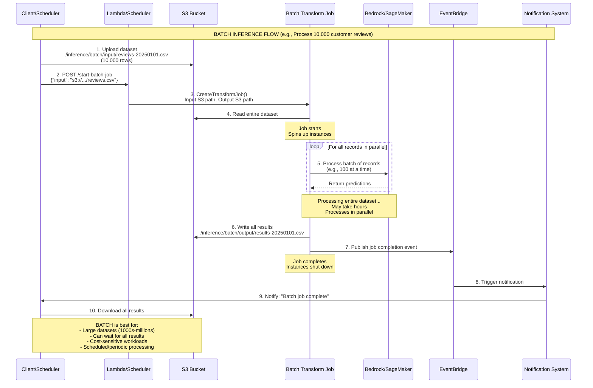

# Amazon SageMaker - Les composantes principales

Amazon SageMaker est une plateforme complète de machine learning dans le cloud AWS. Voici ses principales composantes :

## 1. **Préparation des données**
- **SageMaker Data Wrangler** : interface visuelle pour préparer et transformer les données
- **SageMaker Feature Store** : stockage centralisé et gestion des features pour le ML
- **SageMaker Processing** : traitement de données à grande échelle

## 2. **Développement et entraînement**
- **SageMaker Studio** : environnement de développement intégré (IDE) basé sur JupyterLab
- **SageMaker Notebooks** : notebooks Jupyter managés
- **SageMaker Training** : infrastructure d'entraînement distribuée avec algorithmes intégrés
- **SageMaker Experiments** : suivi et comparaison des expérimentations ML

## 3. **Optimisation**
- **SageMaker Debugger** : débogage et profilage des modèles en temps réel
- **SageMaker Automatic Model Tuning** : optimisation automatique des hyperparamètres

## 4. **Déploiement**
- **SageMaker Endpoints** : déploiement de modèles pour l'inférence en temps réel
- **SageMaker Batch Transform** : inférence par lots
- **SageMaker Inference Recommender** : recommandations pour optimiser les déploiements

## 5. **MLOps et gouvernance**
- **SageMaker Pipelines** : orchestration de workflows ML automatisés
- **SageMaker Model Registry** : versioning et catalogue de modèles
- **SageMaker Model Monitor** : surveillance de la qualité et des dérives des modèles

## 6. **Fonctionnalités spécialisées**
- **SageMaker Clarify** : détection de biais et explicabilité des modèles
- **SageMaker Autopilot** : AutoML pour créer automatiquement des modèles
- **SageMaker Ground Truth** : étiquetage de données avec assistance humaine
- **SageMaker JumpStart** : modèles et solutions pré-entraînés

Chaque composante s'intègre avec les autres pour offrir un flux de travail ML complet, de la préparation des données jusqu'au déploiement en production.


----


# Architecture Design for Custom Blueprints in SageMaker Unified Studio

Here's a comprehensive architecture design for creating custom blueprints for Gen AI sandbox environments:

## 1. **Blueprint Architecture Overview**

### Core Components Structure
```
Custom Blueprint
├── Infrastructure Layer (IaC)
├── Data Layer
├── Model Development Layer
├── Training & Fine-tuning Layer
├── Inference Layer
├── Orchestration Layer
└── Governance & Monitoring Layer
```

## 2. **Infrastructure as Code (IaC) Foundation**

### AWS Services
- **AWS CloudFormation** or **AWS CDK** (Python/TypeScript)
  - Define all infrastructure as code
  - Enable repeatable deployments
  - Version control for blueprints

- **SageMaker Project Templates**
  - Custom MLOps templates
  - Pre-configured with CI/CD pipelines

### Blueprint Components
```python
# Example structure
- cloudformation/
  - vpc-network.yaml
  - iam-roles.yaml
  - sagemaker-domain.yaml
  - storage.yaml
```

## 3. **Data Layer Architecture**

### Services & Tools
- **Amazon S3**
  - Raw data bucket (with versioning)
  - Processed data bucket
  - Model artifacts bucket
  - Feature store offline storage

- **SageMaker Data Wrangler**
  - Pre-built data prep flows
  - Custom transformations
  - Data quality rules

- **SageMaker Feature Store**
  - Online feature store (real-time)
  - Offline feature store (training)
  - Feature groups with metadata

- **AWS Glue**
  - Data catalog
  - ETL jobs for data prep
  - Schema registry

### Architecture Pattern
```
S3 Raw Data → Glue Crawler → Glue Catalog
     ↓
Data Wrangler Flow → Feature Store
     ↓
S3 Processed Data → Training/Inference
```

## 4. **Model Development Layer**

### Services & Tools
- **SageMaker Studio**
  - JupyterLab environment
  - Pre-configured with libraries (transformers, langchain, etc.)
  - Custom kernels for Gen AI

- **SageMaker Notebooks**
  - Lifecycle configurations
  - Pre-installed packages
  - Git integration

- **Amazon CodeCommit/GitHub**
  - Version control for notebooks
  - Code review workflows

### Blueprint Configuration
```yaml
DevelopmentEnvironment:
  StudioDomain: custom-genai-domain
  UserProfiles:
    - DataScientist
    - MLEngineer
  DefaultKernels:
    - Python3-PyTorch
    - Python3-TensorFlow
  PreinstalledLibraries:
    - transformers
    - langchain
    - boto3
    - sagemaker
```

## 5. **Training & Fine-tuning Layer**

### For Gen AI Models

#### A. SageMaker Training Jobs
```
Architecture Components:
├── SageMaker Training Jobs (for fine-tuning)
├── SageMaker Managed Spot Training (cost optimization)
├── Distributed Training (multi-GPU/multi-node)
├── SageMaker Experiments (tracking)
└── ECR (custom container images)
```

#### B. Fine-tuning Strategies
- **Full Fine-tuning**: Complete model retraining
- **LoRA/QLoRA**: Parameter-efficient fine-tuning
- **Prompt Tuning**: Soft prompt optimization

#### Services Integration
```python
# Blueprint structure
TrainingBlueprint:
  - Custom Training Images (ECR)
  - Training Scripts (S3)
  - Hyperparameter Configs
  - Distributed Training Strategy
    - Data Parallel
    - Model Parallel (for large models)
  - Checkpointing (S3)
  - Model Registry Integration
```

### Tools & Services
- **SageMaker Training Jobs**
- **SageMaker Automatic Model Tuning**
- **Amazon ECR** (custom containers)
- **SageMaker Debugger**
- **SageMaker Experiments**

## 6. **Inference Layer Architecture**

### A. Amazon Bedrock Integration

```
Architecture:
├── Bedrock Foundation Models
│   ├── Claude, Llama, Titan, etc.
│   └── Model Customization (fine-tuned)
├── Bedrock Agents
├── Bedrock Knowledge Bases (RAG)
└── Bedrock Guardrails
```

**Implementation Pattern:**
```python
# Lambda + Bedrock for serverless inference
API Gateway → Lambda → Bedrock → Response
                ↓
            CloudWatch Logs
```

### B. SageMaker Inference Options

#### Real-time Inference
```
Architecture:
├── SageMaker Endpoints
│   ├── Multi-model endpoints
│   ├── Multi-container endpoints
│   └── Auto-scaling policies
├── Application Load Balancer (optional)
├── Amazon API Gateway
└── AWS Lambda (for lightweight processing)
```

**Pattern:**
```
Client → API Gateway → Lambda → SageMaker Endpoint
                                      ↓
                              CloudWatch Metrics
                                      ↓
                              Auto-scaling Trigger
```

#### Asynchronous Inference
```
Architecture:
├── S3 Input Bucket
├── SageMaker Async Endpoint
├── SNS Topic (notifications)
├── S3 Output Bucket
└── SQS Queue (optional for batching)
```

**Pattern:**
```
Client → S3 (input) → Async Endpoint → S3 (output)
                            ↓
                        SNS Notification
                            ↓
                    Client/Lambda Callback
```

#### Batch Transform
```
Architecture:
├── S3 Input Data
├── SageMaker Batch Transform Job
├── S3 Output Results
└── EventBridge (job completion)
```

#### Serverless Inference
```
Architecture:
├── SageMaker Serverless Endpoint
│   ├── Memory Configuration (1-6 GB)
│   ├── Max Concurrency
│   └── Cold start optimization
└── Auto-scaling (managed)
```

## 7. **Orchestration Layer with SageMaker Pipelines**

### Pipeline Architecture
```python
GenAI_Pipeline:
  Steps:
    1. Data Processing
       - Lambda or Processing Job
       - Data Wrangler integration
    
    2. Feature Engineering
       - Feature Store ingestion
       - Data validation
    
    3. Model Training/Fine-tuning
       - Training Job with custom container
       - Hyperparameter tuning (optional)
    
    4. Model Evaluation
       - Processing Job
       - Custom metrics (ROUGE, BLEU, etc.)
    
    5. Model Registration
       - Conditional registration
       - Model approval workflow
    
    6. Model Deployment
       - Conditional deployment
       - A/B testing setup
    
    7. Monitoring Setup
       - Model Monitor schedule
       - CloudWatch dashboards
```

### Services
- **SageMaker Pipelines** (MLOps orchestration)
- **AWS Step Functions** (complex workflows)
- **EventBridge** (event-driven triggers)
- **Lambda** (custom logic)

### Example Pipeline Definition
```python
from sagemaker.workflow.pipeline import Pipeline
from sagemaker.workflow.steps import ProcessingStep, TrainingStep

# Define steps
processing_step = ProcessingStep(...)
training_step = TrainingStep(...)
evaluation_step = ProcessingStep(...)
condition_step = ConditionStep(...)
register_step = ModelStep(...)

# Create pipeline
pipeline = Pipeline(
    name="genai-finetuning-pipeline",
    parameters=[...],
    steps=[
        processing_step,
        training_step,
        evaluation_step,
        condition_step,
        register_step
    ]
)
```

## 8. **Governance & Monitoring Layer**

### Services & Architecture
```
Monitoring Stack:
├── SageMaker Model Monitor
│   ├── Data Quality Monitoring
│   ├── Model Quality Monitoring
│   ├── Bias Drift Monitoring
│   └── Feature Attribution Drift
├── CloudWatch
│   ├── Logs (centralized)
│   ├── Metrics
│   └── Dashboards
├── CloudTrail (audit logs)
├── AWS Config (compliance)
└── SageMaker Model Registry
    ├── Model versioning
    ├── Model approval workflow
    └── Model lineage tracking
```

### Additional Tools
- **SageMaker Clarify** (bias detection, explainability)
- **AWS Security Hub** (security posture)
- **Amazon Macie** (data security)

## 9. **Complete Blueprint Architecture Diagram**

```
┌─────────────────────────────────────────────────────────────┐
│                    SAGEMAKER UNIFIED STUDIO                  │
│                      Custom Gen AI Blueprint                 │
└─────────────────────────────────────────────────────────────┘
                              │
        ┌─────────────────────┼─────────────────────┐
        │                     │                     │
        ▼                     ▼                     ▼
┌──────────────┐    ┌──────────────┐    ┌──────────────┐
│  DATA LAYER  │    │ DEVELOPMENT  │    │  TRAINING    │
│              │    │    LAYER     │    │    LAYER     │
│ • S3         │───▶│ • Studio     │───▶│ • Training   │
│ • Glue       │    │ • Notebooks  │    │   Jobs       │
│ • Feature    │    │ • CodeCommit │    │ • HPO        │
│   Store      │    │              │    │ • Experiments│
└──────────────┘    └──────────────┘    └──────────────┘
        │                                       │
        │                                       │
        ▼                                       ▼
┌──────────────────────────────────────────────────────┐
│              ORCHESTRATION LAYER                      │
│         • SageMaker Pipelines                        │
│         • Step Functions                              │
│         • EventBridge                                 │
└──────────────────────────────────────────────────────┘
                        │
        ┌───────────────┼───────────────┐
        │               │               │
        ▼               ▼               ▼
┌──────────┐    ┌─────────────┐  ┌────────────┐
│ BEDROCK  │    │  SAGEMAKER  │  │  BATCH     │
│          │    │  INFERENCE  │  │ TRANSFORM  │
│ • Models │    │             │  │            │
│ • Agents │    │ • Real-time │  │ • S3 I/O   │
│ • KB(RAG)│    │ • Async     │  │ • Scheduled│
│          │    │ • Serverless│  │            │
└──────────┘    └─────────────┘  └────────────┘
        │               │               │
        └───────────────┼───────────────┘
                        │
                        ▼
        ┌───────────────────────────────┐
        │   MONITORING & GOVERNANCE     │
        │ • Model Monitor               │
        │ • CloudWatch                  │
        │ • Model Registry              │
        │ • Clarify                     │
        └───────────────────────────────┘
```

## 10. **Blueprint Implementation Strategy**

### Step 1: Define Blueprint Parameters
```yaml
BlueprintParameters:
  ProjectName: string
  Environment: [dev, staging, prod]
  VPCConfig: 
    UseExisting: boolean
    VPCID: string (optional)
  DataSources:
    S3Buckets: list
    GlueDatabases: list
  ModelConfig:
    BaseModel: string
    InstanceType: string
    InferenceType: [realtime, async, batch, serverless]
  MonitoringEnabled: boolean
```

### Step 2: Create CloudFormation Template
```yaml
# template.yaml
AWSTemplateFormatVersion: '2010-09-09'
Description: 'Gen AI Sandbox Blueprint'

Parameters:
  ProjectName:
    Type: String
  Environment:
    Type: String
    AllowedValues: [dev, staging, prod]

Resources:
  # S3 Buckets
  DataBucket:
    Type: AWS::S3::Bucket
    Properties:
      BucketName: !Sub '${ProjectName}-data-${Environment}'
      VersioningConfiguration:
        Status: Enabled

  # IAM Roles
  SageMakerExecutionRole:
    Type: AWS::IAM::Role
    Properties:
      AssumeRolePolicyDocument: {...}
      ManagedPolicyArns:
        - arn:aws:iam::aws:policy/AmazonSageMakerFullAccess
      Policies: [...]

  # SageMaker Domain
  StudioDomain:
    Type: AWS::SageMaker::Domain
    Properties:
      DomainName: !Sub '${ProjectName}-studio-${Environment}'
      AuthMode: IAM
      DefaultUserSettings: {...}

  # Feature Store
  FeatureGroup:
    Type: AWS::SageMaker::FeatureGroup
    Properties: {...}

  # Model Registry
  ModelPackageGroup:
    Type: AWS::SageMaker::ModelPackageGroup
    Properties:
      ModelPackageGroupName: !Sub '${ProjectName}-models'
```

### Step 3: Create Python CDK Stack (Alternative)
```python
from aws_cdk import (
    Stack,
    aws_sagemaker as sagemaker,
    aws_s3 as s3,
    aws_iam as iam,
)

class GenAIBlueprintStack(Stack):
    def __init__(self, scope, id, **kwargs):
        super().__init__(scope, id, **kwargs)
        
        # S3 Buckets
        data_bucket = s3.Bucket(self, "DataBucket",
            versioned=True,
            encryption=s3.BucketEncryption.S3_MANAGED
        )
        
        # IAM Role
        sagemaker_role = iam.Role(self, "SageMakerRole",
            assumed_by=iam.ServicePrincipal("sagemaker.amazonaws.com"),
            managed_policies=[
                iam.ManagedPolicy.from_aws_managed_policy_name(
                    "AmazonSageMakerFullAccess"
                )
            ]
        )
        
        # SageMaker Domain
        studio_domain = sagemaker.CfnDomain(self, "StudioDomain",
            domain_name=f"{project_name}-studio",
            auth_mode="IAM",
            default_user_settings={...}
        )
```

## 11. **Security & Compliance Architecture**

```
Security Layer:
├── VPC Configuration
│   ├── Private Subnets (SageMaker, training)
│   ├── VPC Endpoints (S3, SageMaker API)
│   └── Security Groups
├── Encryption
│   ├── KMS Keys (data, models)
│   ├── S3 Encryption
│   └── EBS Encryption
├── IAM
│   ├── Least Privilege Roles
│   ├── Service Control Policies
│   └── Resource-based Policies
└── Network Security
    ├── PrivateLink
    ├── Network Isolation
    └── NAT Gateway (if needed)
```

## 12. **Cost Optimization Strategies**

- **Spot Instances** for training
- **Serverless Inference** for sporadic traffic
- **Auto-scaling** for endpoints
- **S3 Lifecycle Policies** for data
- **Reserved Capacity** for production workloads
- **Multi-model Endpoints** to reduce endpoint costs

## 13. **Blueprint Deployment Workflow**

```
1. Blueprint Selection (UI/CLI)
   ↓
2. Parameter Configuration
   ↓
3. CloudFormation Stack Creation
   ↓
4. Resource Provisioning
   - VPC/Network
   - IAM Roles
   - S3 Buckets
   - SageMaker Domain
   - Feature Store
   ↓
5. Initial Configuration
   - Load sample notebooks
   - Configure pipelines
   - Set up monitoring
   ↓
6. Validation & Testing
   ↓
7. Blueprint Ready for Use
```

This architecture provides a comprehensive, scalable, and production-ready foundation for Gen AI workloads in SageMaker Unified Studio. Would you like me to elaborate on any specific component or provide code examples for particular services?


## 1. Tools to Access SMUS Shared Data

### Primary Tools (in order of use):

**A. SageMaker Unified Studio - Data Catalog Browser** 
- **First tool to use** - Native UI to discover and browse shared data
- Access shared catalogs, databases, tables from SMUS main domain
- Search and filter data assets
- View metadata, lineage, and permissions

**B. AWS Lake Formation**
- Manages fine-grained access permissions to shared data
- You'll see data that the main domain account shared with you
- Request additional permissions if needed

**C. Amazon Athena**
- Query shared data directly using SQL
- Access AWS Glue Data Catalog (shared from main domain)
- Interactive exploration of shared datasets

**D. AWS Glue Data Catalog**
- View shared catalog metadata
- Access table schemas, partitions
- Integration with SageMaker Data Wrangler

**E. SageMaker Data Wrangler**
- Connect to shared S3 buckets
- Import and transform shared data
- Create data preparation flows

---

## 2. Visual Architectures

Let me create comprehensive visual architectures:## 3. Async vs Batch Inference - Key Differences & Blueprint Strategy

### **Single S3 Bucket Structure for Both:**

```
s3://my-genai-bucket/
├── data/
│   ├── raw/
│   ├── processed/
│   └── features/
├── artifacts/
│   ├── models/
│   │   ├── bedrock-customized/
│   │   └── sagemaker-finetuned/
│   ├── training-outputs/
│   └── checkpoints/
├── inference/
│   ├── async/
│   │   ├── input/          # Individual requests
│   │   └── output/         # Individual responses
│   └── batch/
│       ├── input/          # Datasets (CSV, JSONL)
│       └── output/         # Result datasets
└── configs/
    ├── pipeline-definitions/
    └── inference-configs/
```

---

### **Comparison: Async vs Batch Inference**

| Aspect | **Async Inference** | **Batch Inference** |
|--------|-------------------|-------------------|
| **Use Case** | Individual large requests with long processing time | Process thousands/millions of records in bulk |
| **Request Pattern** | One request at a time, client waits for notification | Submit entire dataset, process all at once |
| **Latency** | Minutes to hours per request | Hours for entire job (but efficient for volume) |
| **Client Interaction** | Upload input → Get notification → Download output | Upload dataset → Wait for job → Download all results |
| **Cost Efficiency** | Pay per request, good for sporadic large requests | Most cost-effective for large volumes |
| **Notification** | SNS notification per request completion | EventBridge event when entire job completes |
| **Typical Input** | Single large document, image, video | CSV/JSONL with thousands of rows |
| **Processing** | Queue-based, processes requests sequentially | Parallel processing of all records |

---

### **Do You Need Single or Separate Blueprints?**

**Answer: SEPARATE blueprints recommended** - Here's why:

**Different Blueprints:**
1. **Async Inference Blueprint** - For individual large requests
2. **Batch Inference Blueprint** - For bulk processing jobs

**Reasons for Separation:**
- Different infrastructure components (SNS vs EventBridge)
- Different scaling configurations
- Different cost structures
- Different monitoring requirements
- Simpler to maintain and update independently
- Clearer for users to select appropriate method

---

### **Complete Client Cycles Explained:**---

### **Detailed Explanation of Each Cycle:**

#### **ASYNC INFERENCE - Complete Cycle:**

**Scenario:** Client needs to analyze a 100-page PDF document with a Gen AI model

1. **Client uploads payload** → `s3://bucket/inference/async/input/doc-123.pdf` (too large for API)
2. **Client calls API** → Passes S3 path to async endpoint
3. **Async endpoint invoked** → SageMaker reads from S3 input path
4. **Model processes** → Uses Bedrock FM or custom model from S3 artifacts
5. **Processing time** → Takes 5-30 minutes (long-running)
6. **Result written to S3** → `s3://bucket/inference/async/output/result-123.json`
7. **SNS notification sent** → Triggers callback function
8. **Client receives result** → Via webhook, email, or polls S3
9. **Cleanup** → Can archive or delete processed files

**Key Characteristics:**
- ✅ Request-response pattern (1:1)
- ✅ Immediate submission, delayed completion
- ✅ Good for sporadic large requests
- ✅ Client gets notified when done
- ❌ Not efficient for bulk processing

---

#### **BATCH INFERENCE - Complete Cycle:**

**Scenario:** Process 10,000 customer reviews for sentiment analysis overnight

1. **Client uploads dataset** → `s3://bucket/inference/batch/input/reviews.csv` (10,000 rows)
2. **Client/scheduler starts job** → Submits batch transform job configuration
3. **Job initialization** → SageMaker spins up compute instances
4. **Parallel processing** → Processes multiple records simultaneously
5. **Model inference** → Uses Bedrock Batch or custom model from S3 artifacts
6. **Processing time** → Takes 2-4 hours for full dataset
7. **Results written** → `s3://bucket/inference/batch/output/results.csv` (all predictions)
8. **Job completion event** → EventBridge triggers notification
9. **Client downloads results** → Gets entire result dataset
10. **Cleanup** → Instances automatically terminated

**Key Characteristics:**
- ✅ Dataset-level processing (1:many)
- ✅ Most cost-effective for volume
- ✅ Parallel processing efficiency
- ✅ Scheduled/periodic workloads
- ❌ Can't get partial results during processing
- ❌ Higher initial latency (job startup time)

---

## 4. Blueprint Architecture Strategy

### **Recommended Blueprint Structure:**### **Model Source Architecture (Common to All Blueprints):**---

## 5. Model Selection Strategy in Each Blueprint

### **How Each Blueprint Supports Both Model Sources:**

#### **Blueprint Parameter Configuration:**
```
BlueprintConfig:
  ModelSource: [bedrock | sagemaker]
  
  # If Bedrock
  BedrockConfig:
    ModelId: "anthropic.claude-v2"
    ModelType: [base | customized | fine-tuned]
    ProvisionedThroughput: true/false
  
  # If SageMaker
  SageMakerConfig:
    ModelArtifactPath: "s3://bucket/artifacts/models/fine-tuned/model-v1/"
    InstanceType: "ml.g5.xlarge"
    ContainerImage: "custom-inference-image"
```

#### **Architecture Pattern for Dual Support:**
- Each blueprint includes **conditional logic** for model source
- **Bedrock path**: Direct API calls, no model loading needed
- **SageMaker path**: Load model from S3, deploy to endpoint/job
- **Model Registry**: Tracks both Bedrock customized models and SageMaker models

---

## Summary: Blueprint Strategy

### **Recommendation:**

✅ **Create 4 SEPARATE Blueprints:**
1. Real-time Inference Blueprint
2. Async Inference Blueprint ← Focus here for your use case
3. Batch Transform Blueprint ← Focus here for your use case
4. Serverless Inference Blueprint

✅ **Each blueprint supports BOTH:**
- Amazon Bedrock (foundation models, customized, fine-tuned)
- SageMaker models (from S3 artifacts)

✅ **Single S3 Bucket Strategy:**
- Organized folder structure
- Clear separation: `/data/`, `/artifacts/`, `/inference/`
- Async uses: `/inference/async/input|output/`
- Batch uses: `/inference/batch/input|output/`

✅ **Why Separate Blueprints:**
- Different infrastructure (SNS vs EventBridge)
- Different client interaction patterns
- Different cost optimization strategies
- Easier maintenance and updates
- Clearer user experience

The architectures I've provided show how each component integrates with your single S3 bucket and how both model sources (Bedrock and SageMaker) can be used interchangeably in each blueprint.


----

## 1. Tools to Access SMUS Shared Data

### Primary Tools (in order of use):

**A. SageMaker Unified Studio - Data Catalog Browser** 
- **First tool to use** - Native UI to discover and browse shared data
- Access shared catalogs, databases, tables from SMUS main domain
- Search and filter data assets
- View metadata, lineage, and permissions

**B. AWS Lake Formation**
- Manages fine-grained access permissions to shared data
- You'll see data that the main domain account shared with you
- Request additional permissions if needed

**C. Amazon Athena**
- Query shared data directly using SQL
- Access AWS Glue Data Catalog (shared from main domain)
- Interactive exploration of shared datasets

**D. AWS Glue Data Catalog**
- View shared catalog metadata
- Access table schemas, partitions
- Integration with SageMaker Data Wrangler

**E. SageMaker Data Wrangler**
- Connect to shared S3 buckets
- Import and transform shared data
- Create data preparation flows

---

## 2. Visual Architectures

Let me create comprehensive visual architectures:## 3. Async vs Batch Inference - Key Differences & Blueprint Strategy

### **Single S3 Bucket Structure for Both:**

```
s3://my-genai-bucket/
├── data/
│   ├── raw/
│   ├── processed/
│   └── features/
├── artifacts/
│   ├── models/
│   │   ├── bedrock-customized/
│   │   └── sagemaker-finetuned/
│   ├── training-outputs/
│   └── checkpoints/
├── inference/
│   ├── async/
│   │   ├── input/          # Individual requests
│   │   └── output/         # Individual responses
│   └── batch/
│       ├── input/          # Datasets (CSV, JSONL)
│       └── output/         # Result datasets
└── configs/
    ├── pipeline-definitions/
    └── inference-configs/
```

---

### **Comparison: Async vs Batch Inference**

| Aspect | **Async Inference** | **Batch Inference** |
|--------|-------------------|-------------------|
| **Use Case** | Individual large requests with long processing time | Process thousands/millions of records in bulk |
| **Request Pattern** | One request at a time, client waits for notification | Submit entire dataset, process all at once |
| **Latency** | Minutes to hours per request | Hours for entire job (but efficient for volume) |
| **Client Interaction** | Upload input → Get notification → Download output | Upload dataset → Wait for job → Download all results |
| **Cost Efficiency** | Pay per request, good for sporadic large requests | Most cost-effective for large volumes |
| **Notification** | SNS notification per request completion | EventBridge event when entire job completes |
| **Typical Input** | Single large document, image, video | CSV/JSONL with thousands of rows |
| **Processing** | Queue-based, processes requests sequentially | Parallel processing of all records |

---

### **Do You Need Single or Separate Blueprints?**

**Answer: SEPARATE blueprints recommended** - Here's why:

**Different Blueprints:**
1. **Async Inference Blueprint** - For individual large requests
2. **Batch Inference Blueprint** - For bulk processing jobs

**Reasons for Separation:**
- Different infrastructure components (SNS vs EventBridge)
- Different scaling configurations
- Different cost structures
- Different monitoring requirements
- Simpler to maintain and update independently
- Clearer for users to select appropriate method

---

### **Complete Client Cycles Explained:**---

### **Detailed Explanation of Each Cycle:**

#### **ASYNC INFERENCE - Complete Cycle:**

**Scenario:** Client needs to analyze a 100-page PDF document with a Gen AI model

1. **Client uploads payload** → `s3://bucket/inference/async/input/doc-123.pdf` (too large for API)
2. **Client calls API** → Passes S3 path to async endpoint
3. **Async endpoint invoked** → SageMaker reads from S3 input path
4. **Model processes** → Uses Bedrock FM or custom model from S3 artifacts
5. **Processing time** → Takes 5-30 minutes (long-running)
6. **Result written to S3** → `s3://bucket/inference/async/output/result-123.json`
7. **SNS notification sent** → Triggers callback function
8. **Client receives result** → Via webhook, email, or polls S3
9. **Cleanup** → Can archive or delete processed files

**Key Characteristics:**
- ✅ Request-response pattern (1:1)
- ✅ Immediate submission, delayed completion
- ✅ Good for sporadic large requests
- ✅ Client gets notified when done
- ❌ Not efficient for bulk processing

---

#### **BATCH INFERENCE - Complete Cycle:**

**Scenario:** Process 10,000 customer reviews for sentiment analysis overnight

1. **Client uploads dataset** → `s3://bucket/inference/batch/input/reviews.csv` (10,000 rows)
2. **Client/scheduler starts job** → Submits batch transform job configuration
3. **Job initialization** → SageMaker spins up compute instances
4. **Parallel processing** → Processes multiple records simultaneously
5. **Model inference** → Uses Bedrock Batch or custom model from S3 artifacts
6. **Processing time** → Takes 2-4 hours for full dataset
7. **Results written** → `s3://bucket/inference/batch/output/results.csv` (all predictions)
8. **Job completion event** → EventBridge triggers notification
9. **Client downloads results** → Gets entire result dataset
10. **Cleanup** → Instances automatically terminated

**Key Characteristics:**
- ✅ Dataset-level processing (1:many)
- ✅ Most cost-effective for volume
- ✅ Parallel processing efficiency
- ✅ Scheduled/periodic workloads
- ❌ Can't get partial results during processing
- ❌ Higher initial latency (job startup time)

---

## 4. Blueprint Architecture Strategy

### **Recommended Blueprint Structure:**### **Model Source Architecture (Common to All Blueprints):**---

## 5. Model Selection Strategy in Each Blueprint

### **How Each Blueprint Supports Both Model Sources:**

#### **Blueprint Parameter Configuration:**
```
BlueprintConfig:
  ModelSource: [bedrock | sagemaker]
  
  # If Bedrock
  BedrockConfig:
    ModelId: "anthropic.claude-v2"
    ModelType: [base | customized | fine-tuned]
    ProvisionedThroughput: true/false
  
  # If SageMaker
  SageMakerConfig:
    ModelArtifactPath: "s3://bucket/artifacts/models/fine-tuned/model-v1/"
    InstanceType: "ml.g5.xlarge"
    ContainerImage: "custom-inference-image"
```

#### **Architecture Pattern for Dual Support:**
- Each blueprint includes **conditional logic** for model source
- **Bedrock path**: Direct API calls, no model loading needed
- **SageMaker path**: Load model from S3, deploy to endpoint/job
- **Model Registry**: Tracks both Bedrock customized models and SageMaker models

---

## Summary: Blueprint Strategy

### **Recommendation:**

✅ **Create 4 SEPARATE Blueprints:**
1. Real-time Inference Blueprint
2. Async Inference Blueprint ← Focus here for your use case
3. Batch Transform Blueprint ← Focus here for your use case
4. Serverless Inference Blueprint

✅ **Each blueprint supports BOTH:**
- Amazon Bedrock (foundation models, customized, fine-tuned)
- SageMaker models (from S3 artifacts)

✅ **Single S3 Bucket Strategy:**
- Organized folder structure
- Clear separation: `/data/`, `/artifacts/`, `/inference/`
- Async uses: `/inference/async/input|output/`
- Batch uses: `/inference/batch/input|output/`

✅ **Why Separate Blueprints:**
- Different infrastructure (SNS vs EventBridge)
- Different client interaction patterns
- Different cost optimization strategies
- Easier maintenance and updates
- Clearer user experience

The architectures I've provided show how each component integrates with your single S3 bucket and how both model sources (Bedrock and SageMaker) can be used interchangeably in each blueprint.

------

Gen AI Blueprint architecture


```mermaid
graph TB
    subgraph "SMUS Main Domain"
        SCAT[Shared Data Catalog]
        SS3[Shared S3 Data]
    end
    
    subgraph "Your Consumer Account - Single S3 Storage Strategy"
        subgraph "Unified S3 Bucket Structure"
            S3[Single S3 Bucket]
            S3D[/data/<br/>raw/<br/>processed/<br/>features/]
            S3A[/artifacts/<br/>models/<br/>training-outputs/<br/>checkpoints/]
            S3I[/inference/<br/>async-input/<br/>async-output/<br/>batch-input/<br/>batch-output/]
            S3C[/configs/<br/>pipeline-definitions/<br/>training-configs/<br/>inference-configs/]
            
            S3 --> S3D
            S3 --> S3A
            S3 --> S3I
            S3 --> S3C
        end
        
        subgraph "Data & Development Layer"
            SMUS[SageMaker Unified Studio<br/>Access Shared Data]
            DW[Data Wrangler<br/>Transform Data]
            NB[Notebooks<br/>Exploration & Dev]
            FS[Feature Store<br/>ML Features]
        end
        
        subgraph "Training Layer"
            TJ[SageMaker Training Jobs<br/>Fine-tuning]
            EXP[SageMaker Experiments<br/>Tracking]
            MR[Model Registry<br/>Version Control]
        end
        
        subgraph "Pipeline Orchestration"
            PIPE[SageMaker Pipelines<br/>End-to-End Workflows]
        end
        
        subgraph "Inference Layer - Multiple Blueprints"
            subgraph "Blueprint 1: Real-time Inference"
                RT[Real-time Endpoint<br/>Low Latency]
            end
            
            subgraph "Blueprint 2: Async Inference"
                ASYNC[Async Endpoint<br/>Long-running]
            end
            
            subgraph "Blueprint 3: Batch Inference"
                BATCH[Batch Transform<br/>Large Datasets]
            end
            
            subgraph "Blueprint 4: Serverless Inference"
                SLS[Serverless Endpoint<br/>Sporadic Traffic]
            end
        end
        
        subgraph "Model Sources"
            BR[Amazon Bedrock<br/>Foundation Models]
            SM[SageMaker Models<br/>Fine-tuned/Custom]
        end
        
        subgraph "Monitoring Layer"
            CW[CloudWatch<br/>Metrics & Logs]
            MM[Model Monitor<br/>Quality Tracking]
        end
    end
    
    SCAT -->|Discover| SMUS
    SS3 -->|Access| DW
    
    SMUS --> DW
    DW --> S3D
    S3D --> NB
    S3D --> FS
    
    NB --> TJ
    FS --> TJ
    TJ --> S3A
    TJ --> EXP
    S3A --> MR
    
    MR --> PIPE
    S3D --> PIPE
    PIPE --> RT
    PIPE --> ASYNC
    PIPE --> BATCH
    PIPE --> SLS
    
    BR -.->|Use FM| RT
    BR -.->|Use FM| ASYNC
    BR -.->|Use FM| BATCH
    BR -.->|Use FM| SLS
    
    S3A -.->|Load Model| SM
    SM -->|Deploy| RT
    SM -->|Deploy| ASYNC
    SM -->|Deploy| BATCH
    SM -->|Deploy| SLS
    
    RT --> CW
    ASYNC --> CW
    BATCH --> CW
    SLS --> CW
    
    RT --> MM
    ASYNC --> MM
    BATCH --> MM
    SLS --> MM
    
    style S3 fill:#FF9800
    style RT fill:#4CAF50
    style ASYNC fill:#2196F3
    style BATCH fill:#9C27B0
    style SLS fill:#00BCD4
    style BR fill:#FF6B6B
    style SM fill:#FFC107
  ```


Asynch vs Batch inference

```mermaid
graph TB
    subgraph "Single S3 Bucket - Inference Folders"
        S3[S3 Bucket: my-genai-bucket]
        S3AI[/inference/async/input/]
        S3AO[/inference/async/output/]
        S3BI[/inference/batch/input/]
        S3BO[/inference/batch/output/]
        S3M[/artifacts/models/]
        
        S3 --> S3AI
        S3 --> S3AO
        S3 --> S3BI
        S3 --> S3BO
        S3 --> S3M
    end
    
    subgraph "ASYNC INFERENCE - Client Cycle"
        AC[Client Application]
        AAPI[API Gateway /<br/>Lambda]
        
        subgraph "Async Endpoint Blueprint"
            AEP[SageMaker<br/>Async Endpoint]
            ABR[Bedrock Model<br/>OR]
            ASM[SageMaker Model<br/>from S3]
        end
        
        ASNS[SNS Topic<br/>Notification]
        ACB[Client Callback<br/>Function]
        
        AC -->|"1. Upload large payload"| S3AI
        AC -->|"2. Invoke async endpoint<br/>(S3 input path)"| AAPI
        AAPI -->|"3. Trigger inference"| AEP
        
        S3M -.->|Load if needed| ASM
        ABR -.->|"Or use Bedrock"| AEP
        ASM -.->|Deploy| AEP
        
        AEP -->|"4. Read input"| S3AI
        AEP -->|"5. Process<br/>(minutes to hours)"| AEP
        AEP -->|"6. Write result"| S3AO
        AEP -->|"7. Send notification"| ASNS
        ASNS -->|"8. Trigger"| ACB
        ACB -->|"9. Download result"| S3AO
        ACB -->|"10. Return to client"| AC
    end
    
    subgraph "BATCH INFERENCE - Client Cycle"
        BC[Client / Scheduler]
        BL[Lambda /<br/>EventBridge]
        
        subgraph "Batch Transform Blueprint"
            BTJ[SageMaker<br/>Batch Transform Job]
            BBR[Bedrock Batch<br/>OR]
            BSM[SageMaker Model<br/>from S3]
        end
        
        BEB[EventBridge<br/>Job Completion]
        BNF[Notification /<br/>Next Step]
        
        BC -->|"1. Upload dataset<br/>(CSV, JSON, etc.)"| S3BI
        BC -->|"2. Start batch job<br/>(entire dataset)"| BL
        BL -->|"3. Create transform job"| BTJ
        
        S3M -.->|Load if needed| BSM
        BBR -.->|"Or use Bedrock Batch"| BTJ
        BSM -.->|Deploy| BTJ
        
        BTJ -->|"4. Read all inputs"| S3BI
        BTJ -->|"5. Process in parallel<br/>(batch processing)"| BTJ
        BTJ -->|"6. Write all results"| S3BO
        BTJ -->|"7. Job completion event"| BEB
        BEB -->|"8. Trigger"| BNF
        BNF -->|"9. Results ready<br/>(download when ready)"| BC
        BC -->|"10. Download results"| S3BO
    end
    
    style S3 fill:#FF9800
    style AEP fill:#2196F3
    style BTJ fill:#9C27B0
    style ASNS fill:#4CAF50
    style BEB fill:#4CAF50
    style ABR fill:#FF6B6B
    style BBR fill:#FF6B6B
    style ASM fill:#FFC107
    style BSM fill:#FFC107
  ```

Detailed Client Interaction Flow

```mermaid
sequenceDiagram
    participant C as Client
    participant API as API Gateway/Lambda
    participant S3 as S3 Bucket
    participant AE as Async Endpoint
    participant BR as Bedrock/SageMaker
    participant SNS as SNS Topic
    participant CB as Callback Function
    
    Note over C,CB: ASYNC INFERENCE FLOW (e.g., Process 100-page PDF)
    
    C->>S3: 1. Upload input file<br/>/inference/async/input/request-123.pdf
    C->>API: 2. POST /invoke-async<br/>{"input_path": "s3://.../request-123.pdf"}
    API->>AE: 3. InvokeEndpointAsync(S3 path)
    AE->>S3: 4. Read input file
    AE->>BR: 5. Process with model<br/>(Bedrock or S3 model)
    Note over AE,BR: Processing...<br/>May take minutes
    BR-->>AE: 6. Return result
    AE->>S3: 7. Write output<br/>/inference/async/output/result-123.json
    AE->>SNS: 8. Publish completion event
    SNS->>CB: 9. Trigger callback
    CB->>S3: 10. Download result
    CB->>C: 11. Send result via webhook/email
    C->>S3: 12. Download from S3 (optional)
    
    Note over C,S3: ASYNC is best for:<br/>- Large individual requests<br/>- Long processing times<br/>- Need immediate notification<br/>- Sporadic workload

```




Inference Blueprint Structure

```mermaid
graph TB
    subgraph "Blueprint Selection by Use Case"
        UC[User Selects Use Case]
        UC --> RT[Real-time<br/>< 1 second]
        UC --> ASYNC[Async<br/>Minutes-Hours]
        UC --> BATCH[Batch<br/>Hours]
        UC --> SLS[Serverless<br/>Sporadic]
    end
    
    subgraph "Shared Infrastructure Components"
        S3[Single S3 Bucket<br/>Organized Structure]
        IAM[IAM Roles<br/>Shared Policies]
        CW[CloudWatch<br/>Centralized Monitoring]
        MR[Model Registry<br/>Version Control]
    end
    
    subgraph "Blueprint 1: Real-time Inference"
        RT1[API Gateway]
        RT2[SageMaker Endpoint<br/>Always-on]
        RT3[Auto-scaling Policy]
        RT4[Model Selection]
        RT4A[Bedrock API]
        RT4B[SageMaker Model<br/>from S3]
        
        RT1 --> RT2
        RT2 --> RT3
        RT2 --> RT4
        RT4 --> RT4A
        RT4 --> RT4B
    end
    
    subgraph "Blueprint 2: Async Inference"
        AS1[API Gateway/Lambda]
        AS2[SageMaker Async Endpoint]
        AS3[S3 Input Queue]
        AS4[S3 Output Storage]
        AS5[SNS Notifications]
        AS6[Model Selection]
        AS6A[Bedrock API]
        AS6B[SageMaker Model<br/>from S3]
        
        AS1 --> AS2
        AS2 --> AS3
        AS2 --> AS4
        AS2 --> AS5
        AS2 --> AS6
        AS6 --> AS6A
        AS6 --> AS6B
    end
    
    subgraph "Blueprint 3: Batch Transform"
        BT1[Lambda/Scheduler]
        BT2[Batch Transform Job]
        BT3[S3 Input Dataset]
        BT4[S3 Output Results]
        BT5[EventBridge]
        BT6[Model Selection]
        BT6A[Bedrock Batch]
        BT6B[SageMaker Model<br/>from S3]
        
        BT1 --> BT2
        BT2 --> BT3
        BT2 --> BT4
        BT2 --> BT5
        BT2 --> BT6
        BT6 --> BT6A
        BT6 --> BT6B
    end
    
    subgraph "Blueprint 4: Serverless"
        SL1[API Gateway]
        SL2[Serverless Endpoint<br/>Auto-scaling]
        SL3[Cold Start Optimization]
        SL4[Model Selection]
        SL4A[Bedrock API]
        SL4B[SageMaker Model<br/>from S3]
        
        SL1 --> SL2
        SL2 --> SL3
        SL2 --> SL4
        SL4 --> SL4A
        SL4 --> SL4B
    end
    
    S3 -.-> RT2
    S3 -.-> AS3
    S3 -.-> AS4
    S3 -.-> BT3
    S3 -.-> BT4
    
    MR -.-> RT4B
    MR -.-> AS6B
    MR -.-> BT6B
    MR -.-> SL4B
    
    RT2 --> CW
    AS2 --> CW
    BT2 --> CW
    SL2 --> CW
    
    style RT2 fill:#4CAF50
    style AS2 fill:#2196F3
    style BT2 fill:#9C27B0
    style SL2 fill:#00BCD4
    style S3 fill:#FF9800
    style RT4A fill:#FF6B6B
    style AS6A fill:#FF6B6B
    style BT6A fill:#FF6B6B
    style SL4A fill:#FF6B6B
```




## SMUS Catalog

# Data Catalog Explained - SMUS Multi-Account Context

## 1. **The Three Types of Catalogs**

### **A. AWS Glue Data Catalog (Technical Foundation)**

**What it is:**
- AWS-native metadata repository
- **Exists in EVERY AWS account independently**
- Stores database and table schemas, partitions, data locations
- Technical metadata service (like a database schema registry)

**Key characteristics:**
- **Account-specific**: Each account (M, P, C) has its own Glue Data Catalog
- **Serverless**: Fully managed by AWS
- **Hive Metastore compatible**: Works with EMR, Athena, Redshift, etc.
- **Schema registry**: Stores table definitions, not actual data

**Example content:**
```
Database: sales_data
├── Table: customer_orders
│   ├── Columns: order_id, customer_id, amount, date
│   ├── Location: s3://producer-bucket/orders/
│   ├── Format: Parquet
│   └── Partitions: year=2024/month=12/
```

---

### **B. SMUS Catalog (Business/Governance Layer)**

**What it is:**
- **Built ON TOP of AWS Glue Data Catalog**
- Enterprise data catalog with business context
- Part of SageMaker Unified Studio
- **Centralized view** across multiple accounts
- Adds governance, lineage, business metadata

**Key characteristics:**
- **Lives in Account M** (Main SMUS Domain)
- **Aggregates metadata** from multiple producer accounts
- **Business-friendly interface** (not just technical schemas)
- **Governance layer**: Data quality, lineage, ownership
- **Discovery tool**: Search, browse, request access

**What SMUS adds to Glue:**
- Business glossary (terms, definitions)
- Data quality metrics
- Data lineage (upstream/downstream)
- Data ownership and stewardship
- Access request workflows
- Usage analytics

---

### **C. Shared/Cross-Account Glue Catalog**

**What it is:**
- AWS Glue Data Catalog **shared between accounts**
- Technical mechanism for cross-account metadata access
- Producer's catalog appears in consumer's account

**How it works:**
- Producer (Account P) shares their Glue catalog → Main Domain (Account M)
- Main Domain grants access → Consumer (Account C)
- Consumer sees shared tables in their local Glue catalog view

---

## 2. **Detailed Comparison**## 3. **Complete Data Sharing Flow: Producer → SMUS → Consumer**## 4. **Catalog Relationships - Detailed Architecture**## 5. **Key Differences Explained with Examples**

### **Example Scenario: Sales Data Sharing**

#### **Producer Account P - Initial Setup:**

```
1. Raw Data in S3:
   s3://producer-sales-bucket/
   ├── orders/
   │   ├── year=2024/
   │   │   └── month=12/
   │   │       └── data.parquet
   
2. Glue Crawler scans S3 → Creates in GLUE CATALOG (Account P):
   
   AWS Glue Data Catalog (Account P):
   ├── Database: sales_db
   │   └── Table: orders
   │       ├── Columns: order_id, customer_id, amount, date
   │       ├── Location: s3://producer-sales-bucket/orders/
   │       ├── Format: Parquet
   │       └── Partitions: year, month
   
   → This is purely TECHNICAL metadata
   → Only visible in Account P
   → No business context yet
```

#### **Main SMUS Domain (Account M) - After Sharing:**

```
3. Producer shares via Lake Formation:
   
   Lake Formation (P) → Share sales_db → Account M
   
4. SMUS Catalog receives and enriches:
   
   SMUS Catalog (Account M):
   ├── Dataset: "Sales Orders" ← Business-friendly name
   │   ├── Technical Source: sales_db.orders (from Account P)
   │   ├── Description: "Daily customer orders from e-commerce platform"
   │   ├── Owner: "Sales Analytics Team"
   │   ├── Tags: [PII, Revenue, Production]
   │   ├── Data Quality: 95% completeness
   │   ├── Lineage: 
   │   │   Upstream: E-commerce Platform API
   │   │   Downstream: Sales Dashboard, ML Models
   │   ├── Business Glossary:
   │   │   - "order_id": Unique transaction identifier
   │   │   - "amount": Total order value in USD
   │   └── Access Policy: Requires approval from Sales team
   
   → This is BUSINESS metadata
   → Visible to all SMUS users
   → Searchable and discoverable
```

#### **Consumer Account C - After Access Granted:**

```
5. Consumer sees in their LOCAL Glue Catalog:
   
   AWS Glue Data Catalog (Account C):
   ├── Local databases:
   │   └── my_experiments_db (consumer's own data)
   │
   └── Shared databases:
       └── sales_db (from Account P) ← Appears as shared
           └── Table: orders
               ├── Columns: order_id, customer_id, amount, date
               ├── Location: s3://producer-sales-bucket/orders/
               └── [Shared from Account P]
   
   → Same technical metadata as Account P
   → Visible in consumer's Glue console
   → Can query with Athena directly
   
6. Consumer queries:
   
   Amazon Athena (Account C):
   SELECT * FROM sales_db.orders WHERE year=2024
   
   → Athena reads metadata from local Glue catalog (shared view)
   → Athena reads DATA directly from s3://producer-sales-bucket/
   → Cross-account S3 access enabled via Lake Formation
```

---

## 6. **Why Three Layers Exist**

### **Separation of Concerns:**

| Layer | Purpose | Analogy |
|-------|---------|---------|
| **AWS Glue Catalog** | Technical schema registry | Library catalog (book locations, ISBN) |
| **SMUS Catalog** | Business discovery & governance | Library with reviews, summaries, recommendations |
| **Shared Catalog** | Cross-account access mechanism | Inter-library loan system |

### **Benefits:**

1. **Glue Catalog**: 
   - Fast, technical queries
   - Works with all AWS analytics tools
   - Decentralized (each account manages its own)

2. **SMUS Catalog**:
   - Business users can find data without knowing schemas
   - Governance and compliance tracking
   - Central point for data discovery

3. **Shared Catalog**:
   - Secure cross-account access
   - No data copying needed
   - Fine-grained permissions

---

## 7. **Practical Workflow for Consumer (You)**

### **Step-by-Step: How You Access Shared Data**

```
As Consumer in Account C:

1. DISCOVER via SMUS Catalog:
   ├── Open SageMaker Unified Studio
   ├── Search: "sales data"
   ├── Find: "Sales Orders" dataset
   └── See business context (owner, quality, description)

2. REQUEST ACCESS:
   ├── Click "Request Access" in SMUS
   ├── Approval workflow triggers
   └── Lake Formation grants permissions

3. ACCESS via Glue Catalog:
   ├── Open AWS Glue Console (your account)
   ├── See "sales_db" under "Shared databases"
   └── View table schema

4. USE DATA:
   Option A - Athena:
   └── Query directly: SELECT * FROM sales_db.orders
   
   Option B - Data Wrangler:
   ├── Create Data Wrangler flow
   ├── Connect to Glue catalog
   ├── Select sales_db.orders
   └── Transform and process
   
   Option C - SageMaker Notebook:
   └── Use Boto3 to query via Athena or read from S3

5. DATA FLOWS:
   ├── Metadata: From producer's Glue → Your Glue (shared view)
   ├── Actual Data: Read directly from producer's S3
   └── No data copying: Efficient and secure
```

---

## Summary

**Three Catalog Types:**

1. **AWS Glue Data Catalog** (Technical)
   - Per-account metadata repository
   - Schema definitions
   - Every account has one

2. **SMUS Catalog** (Business)
   - Lives in Account M
   - Built on top of Glue
   - Business context + governance
   - Central discovery platform

3. **Shared Glue Catalog** (Cross-account)
   - Producer's catalog shared to consumers
   - Appears in consumer's Glue console
   - Enables cross-account queries

**Relationship:**
```
Producer Glue → Lake Formation → SMUS Catalog (Main) → Lake Formation → Consumer Glue
     ↓                                                                        ↓
Producer S3 ←─────────────── Direct access ──────────────────────────────→ Consumer Tools
```

The key insight: **SMUS is a layer ON TOP of Glue**, not a replacement. It aggregates multiple Glue catalogs and adds business value, while consumers still use Glue for technical access.


(from part 2:  Detailed Comparison)

<!DOCTYPE html>
<html lang="en">
<head>
    <meta charset="UTF-8">
    <meta name="viewport" content="width=device-width, initial-scale=1.0">
    <title>Catalog Comparison</title>
    <style>
        * {
            margin: 0;
            padding: 0;
            box-sizing: border-box;
        }
        
        body {
            font-family: 'Segoe UI', Tahoma, Geneva, Verdana, sans-serif;
            background: linear-gradient(135deg, #667eea 0%, #764ba2 100%);
            padding: 20px;
            min-height: 100vh;
        }
        
        .container {
            max-width: 1400px;
            margin: 0 auto;
            background: white;
            border-radius: 20px;
            box-shadow: 0 20px 60px rgba(0,0,0,0.3);
            overflow: hidden;
        }
        
        .header {
            background: linear-gradient(135deg, #667eea 0%, #764ba2 100%);
            color: white;
            padding: 30px;
            text-align: center;
        }
        
        .header h1 {
            font-size: 2.5em;
            margin-bottom: 10px;
        }
        
        .comparison-table {
            overflow-x: auto;
            padding: 20px;
        }
        
        table {
            width: 100%;
            border-collapse: collapse;
            font-size: 14px;
        }
        
        thead {
            background: linear-gradient(135deg, #667eea 0%, #764ba2 100%);
            color: white;
        }
        
        th {
            padding: 20px 15px;
            text-align: left;
            font-weight: 600;
            font-size: 16px;
        }
        
        th:first-child {
            border-radius: 10px 0 0 0;
        }
        
        th:last-child {
            border-radius: 0 10px 0 0;
        }
        
        tbody tr {
            border-bottom: 1px solid #e0e0e0;
            transition: background 0.3s;
        }
        
        tbody tr:hover {
            background: #f5f5f5;
        }
        
        td {
            padding: 18px 15px;
            vertical-align: top;
        }
        
        td:first-child {
            font-weight: 600;
            color: #667eea;
            width: 200px;
        }
        
        .tag {
            display: inline-block;
            padding: 4px 12px;
            border-radius: 15px;
            font-size: 12px;
            font-weight: 600;
            margin: 2px;
        }
        
        .tag-technical {
            background: #FFE082;
            color: #F57F17;
        }
        
        .tag-business {
            background: #B39DDB;
            color: #4527A0;
        }
        
        .tag-shared {
            background: #81C784;
            color: #2E7D32;
        }
        
        .icon {
            font-size: 18px;
            margin-right: 8px;
        }
        
        .code {
            background: #f5f5f5;
            padding: 2px 6px;
            border-radius: 4px;
            font-family: 'Courier New', monospace;
            font-size: 13px;
            color: #d32f2f;
        }
        
        ul {
            margin: 10px 0;
            padding-left: 20px;
        }
        
        li {
            margin: 5px 0;
        }
    </style>
</head>
<body>
    <div class="container">
        <div class="header">
            <h1>📊 Data Catalog Comparison</h1>
            <p>Understanding the Three Catalog Types in SMUS Architecture</p>
        </div>
        
        <div class="comparison-table">
            <table>
                <thead>
                    <tr>
                        <th>Aspect</th>
                        <th><span class="icon">🔧</span>AWS Glue Data Catalog</th>
                        <th><span class="icon">🏢</span>SMUS Catalog</th>
                        <th><span class="icon">🔄</span>Shared Glue Catalog</th>
                    </tr>
                </thead>
                <tbody>
                    <tr>
                        <td>Type</td>
                        <td>
                            <span class="tag tag-technical">Technical</span>
                            <br>Metadata repository service
                        </td>
                        <td>
                            <span class="tag tag-business">Business</span>
                            <br>Governance & discovery platform
                        </td>
                        <td>
                            <span class="tag tag-shared">Cross-Account</span>
                            <br>Shared metadata view
                        </td>
                    </tr>
                    
                    <tr>
                        <td>Scope</td>
                        <td>
                            <strong>Account-specific</strong>
                            <ul>
                                <li>Each AWS account has its own</li>
                                <li>Independent per account</li>
                                <li>Not shared by default</li>
                            </ul>
                        </td>
                        <td>
                            <strong>Organization-wide</strong>
                            <ul>
                                <li>Lives in Account M (Main Domain)</li>
                                <li>Central view across all accounts</li>
                                <li>Aggregates metadata from producers</li>
                            </ul>
                        </td>
                        <td>
                            <strong>Cross-account</strong>
                            <ul>
                                <li>Producer catalog visible to consumers</li>
                                <li>Appears in consumer's Glue view</li>
                                <li>Managed via Lake Formation</li>
                            </ul>
                        </td>
                    </tr>
                    
                    <tr>
                        <td>Location</td>
                        <td>
                            <span class="code">Account P</span> has its own<br>
                            <span class="code">Account C</span> has its own<br>
                            <span class="code">Account M</span> has its own
                        </td>
                        <td>
                            <strong>Only in Account M</strong><br>
                            Central SMUS Domain
                        </td>
                        <td>
                            <strong>Appears in multiple accounts</strong><br>
                            Producer's catalog visible to consumers
                        </td>
                    </tr>
                    
                    <tr>
                        <td>What it stores</td>
                        <td>
                            <ul>
                                <li>Database schemas</li>
                                <li>Table definitions</li>
                                <li>Column names & types</li>
                                <li>S3 data locations</li>
                                <li>Partitions</li>
                                <li>SerDe properties</li>
                            </ul>
                        </td>
                        <td>
                            <ul>
                                <li>Everything from Glue PLUS:</li>
                                <li>Business glossary</li>
                                <li>Data lineage</li>
                                <li>Data quality metrics</li>
                                <li>Data ownership</li>
                                <li>Access policies</li>
                                <li>Usage analytics</li>
                            </ul>
                        </td>
                        <td>
                            <ul>
                                <li>Reference to producer's catalog</li>
                                <li>Same metadata as source Glue</li>
                                <li>Permission mappings</li>
                                <li>Access grants</li>
                            </ul>
                        </td>
                    </tr>
                    
                    <tr>
                        <td>Interface</td>
                        <td>
                            <ul>
                                <li>AWS Glue Console</li>
                                <li>AWS CLI</li>
                                <li>Boto3 SDK</li>
                                <li>Technical/developer focused</li>
                            </ul>
                        </td>
                        <td>
                            <ul>
                                <li>SageMaker Unified Studio UI</li>
                                <li>Search & browse interface</li>
                                <li>Business-user friendly</li>
                                <li>Data marketplace feel</li>
                            </ul>
                        </td>
                        <td>
                            <ul>
                                <li>Appears in consumer's Glue Console</li>
                                <li>Athena can query it</li>
                                <li>Data Wrangler can access it</li>
                                <li>Same as local Glue tables</li>
                            </ul>
                        </td>
                    </tr>
                    
                    <tr>
                        <td>Purpose</td>
                        <td>
                            <strong>Schema registry</strong>
                            <br>Enable SQL queries on S3 data
                        </td>
                        <td>
                            <strong>Data discovery & governance</strong>
                            <br>Find, understand, and request data
                        </td>
                        <td>
                            <strong>Cross-account access</strong>
                            <br>Share metadata between accounts
                        </td>
                    </tr>
                    
                    <tr>
                        <td>Permissions</td>
                        <td>
                            <strong>IAM-based</strong>
                            <ul>
                                <li>IAM policies</li>
                                <li>Resource-based policies</li>
                                <li>Within single account</li>
                            </ul>
                        </td>
                        <td>
                            <strong>Lake Formation + SMUS</strong>
                            <ul>
                                <li>Fine-grained permissions</li>
                                <li>Column-level security</li>
                                <li>Approval workflows</li>
                            </ul>
                        </td>
                        <td>
                            <strong>Lake Formation grants</strong>
                            <ul>
                                <li>Cross-account permissions</li>
                                <li>Table/column level access</li>
                                <li>Managed by Account M</li>
                            </ul>
                        </td>
                    </tr>
                    
                    <tr>
                        <td>Use case</td>
                        <td>
                            <ul>
                                <li>Query S3 with Athena</li>
                                <li>ETL jobs with Glue</li>
                                <li>Schema evolution</li>
                                <li>Partition management</li>
                            </ul>
                        </td>
                        <td>
                            <ul>
                                <li>Discover available datasets</li>
                                <li>Understand data meaning</li>
                                <li>Request data access</li>
                                <li>Track data lineage</li>
                                <li>Monitor data quality</li>
                            </ul>
                        </td>
                        <td>
                            <ul>
                                <li>Access producer's data</li>
                                <li>Query shared tables</li>
                                <li>Build ML features</li>
                                <li>Cross-account analytics</li>
                            </ul>
                        </td>
                    </tr>
                </tbody>
            </table>
        </div>
    </div>
</body>
</html>


3. Complete Data Sharing Flow: Producer → SMUS → Consumer

```mermaid
sequenceDiagram
    participant P as Account P (Producer)
    participant S3P as S3 Bucket (Producer)
    participant GCP as Glue Catalog (P)
    participant LFP as Lake Formation (P)
    participant M as Account M (Main SMUS)
    participant SMUS as SMUS Catalog
    participant LFM as Lake Formation (M)
    participant C as Account C (Consumer)
    participant GCC as Glue Catalog (C)
    participant ATHY as Athena (C)
    
    Note over P,LFP: STEP 1: Producer Prepares Data
    
    P->>S3P: 1. Upload raw data<br/>s3://producer-bucket/sales/
    P->>GCP: 2. Run Glue Crawler
    GCP->>S3P: 3. Scan S3 location
    S3P-->>GCP: 4. Return schema
    GCP->>GCP: 5. Create table definition<br/>Database: sales_db<br/>Table: orders
    P->>LFP: 6. Register S3 location<br/>with Lake Formation
    LFP->>LFP: 7. Set up permissions
    
    Note over P,M: STEP 2: Share to SMUS Main Domain
    
    P->>LFP: 8. Create Resource Share<br/>Share sales_db with Account M
    LFP->>M: 9. Send share invitation
    M->>LFM: 10. Accept share
    LFM->>SMUS: 11. Import shared catalog
    SMUS->>SMUS: 12. Enrich metadata<br/>- Business terms<br/>- Data quality<br/>- Ownership
    
    Note over M,C: STEP 3: Consumer Discovers Data
    
    C->>SMUS: 13. Browse SMUS Catalog<br/>Search "sales data"
    SMUS-->>C: 14. Show available datasets<br/>Database: sales_db<br/>Table: orders
    C->>SMUS: 15. Request access to orders table
    SMUS->>LFM: 16. Approval workflow
    LFM->>LFM: 17. Grant permissions
    
    Note over C,ATHY: STEP 4: Consumer Accesses Data
    
    LFM->>C: 18. Grant catalog access
    C->>GCC: 19. View shared tables in<br/>local Glue Catalog
    GCC-->>C: 20. Display:<br/>sales_db.orders (shared)
    C->>ATHY: 21. Query data<br/>SELECT * FROM sales_db.orders
    ATHY->>GCC: 22. Get table metadata
    GCC-->>ATHY: 23. S3 location: s3://producer-bucket/
    ATHY->>S3P: 24. Read data directly<br/>(cross-account S3 access)
    S3P-->>ATHY: 25. Return query results
    ATHY-->>C: 26. Display results
    
    Note over P,C: Data flows: S3(P) → Athena(C)<br/>Metadata flows: Glue(P) → SMUS(M) → Glue(C)
  ```


```mermaid
graph TB
    subgraph L1["LAYER 1: Storage - Where Data Lives"]
        S3P["S3 Bucket - Producer<br/>s3://producer-data/sales/"]
        S3P2["S3 Bucket - Producer 2<br/>s3://producer2-data/marketing/"]
    end
    
    subgraph L2["LAYER 2: Technical Metadata - AWS Glue Catalogs"]
        direction TB
        
        subgraph AP["Account P - Producer 1"]
            GCP["Glue Data Catalog<br/>Database: sales_db<br/>Table: orders<br/>Columns: order_id, amount, date<br/>Location: s3://producer-data/sales/"]
        end
        
        subgraph AP2["Account P2 - Producer 2"]
            GCP2["Glue Data Catalog<br/>Database: marketing_db<br/>Table: campaigns<br/>Columns: campaign_id, budget<br/>Location: s3://producer2-data/"]
        end
        
        subgraph AC["Account C - Consumer"]
            GCC["Glue Data Catalog<br/>Local: my_local_db<br/>Shared: sales_db from P<br/>Shared: marketing_db from P2"]
        end
    end
    
    subgraph L3["LAYER 3: Governance & Sharing - Lake Formation"]
        direction TB
        
        subgraph PRA["Producer Accounts"]
            LFP["Lake Formation P<br/>Share sales_db to M"]
            LFP2["Lake Formation P2<br/>Share marketing_db to M"]
        end
        
        subgraph MAIN["Main SMUS Domain"]
            LFM["Lake Formation M<br/>Received: sales_db, marketing_db<br/>Grant to: Account C"]
        end
        
        subgraph CONS["Consumer Account"]
            LFC["Lake Formation C<br/>Permissions: SELECT on shared DBs"]
        end
    end
    
    subgraph L4["LAYER 4: Business Layer - SMUS Catalog"]
        SMUS["SMUS Data Catalog<br/>Dataset: Sales Orders<br/>Owner: Sales Team<br/>Quality: 95%<br/>Tags: PII, Finance<br/>Dataset: Marketing Campaigns<br/>Owner: Marketing Team"]
    end
    
    subgraph L5["LAYER 5: Consumer Tools"]
        TOOLS["SageMaker Unified Studio<br/>Amazon Athena<br/>Data Wrangler<br/>SageMaker Notebooks"]
    end
    
    S3P -->|metadata| GCP
    S3P2 -->|metadata| GCP2
    
    GCP -->|share| LFP
    GCP2 -->|share| LFP2
    
    LFP -->|send to| LFM
    LFP2 -->|send to| LFM
    
    LFM -->|import| SMUS
    LFM -->|grant| LFC
    
    LFC -->|visible in| GCC
    
    GCC -->|query| TOOLS
    SMUS -->|discover| TOOLS
    
    TOOLS -->|read data| S3P
    TOOLS -->|read data| S3P2
    
    style S3P fill:#FF9800,color:#000
    style S3P2 fill:#FF9800,color:#000
    style GCP fill:#FFC107,color:#000
    style GCP2 fill:#FFC107,color:#000
    style GCC fill:#FFC107,color:#000
    style LFP fill:#4ECDC4,color:#000
    style LFP2 fill:#4ECDC4,color:#000
    style LFM fill:#4ECDC4,color:#000
    style LFC fill:#4ECDC4,color:#000
    style SMUS fill:#FF6B6B,color:#000
    style TOOLS fill:#95E1D3,color:#000

```


----------------------------------------------------------------------------------------------------

## Managmement APP

The creation of a management application for Amazon SageMaker Unified Studio (SMUS) using AWS Python SDKs (like Boto3) would primarily involve interfacing with the specialized Amazon SageMaker Unified Studio Library for Python for foundational project interactions, and the underlying AWS DataZone and other AWS service SDKs for catalog, asset, and security management.
The sources explicitly mention the existence and capabilities of the sagemaker_studio Python library and provide many API and CLI references that map to AWS DataZone service actions.
Here is a table detailing the relevant management features, the appropriate SDKs, and corresponding functions as described in the provided sources:


The creation of a management application for Amazon SageMaker Unified Studio (SMUS) using AWS Python SDKs (like Boto3) would primarily involve interfacing with the specialized **Amazon SageMaker Unified Studio Library for Python** for foundational project interactions, and the underlying **AWS DataZone** and other AWS service SDKs for catalog, asset, and security management.

The sources explicitly mention the existence and capabilities of the `sagemaker_studio` Python library and provide many API and CLI references that map to AWS DataZone service actions.

Here is a table detailing the relevant management features, the appropriate SDKs, and corresponding functions as described in the provided sources:


| Feature/Functionality | AWS SDK/Library | Adapted Functions (API/Client Methods) | Link to SDK Documentation | Additional Context |
| :--- | :--- | :--- | :--- | :--- |
| **Project & Domain Information (Read)** | **SageMaker Unified Studio Library for Python** (`sagemaker_studio`) | `Domain(id=...)` (for domain details) `Project(name=..., domain_id=...)` (for project details) `proj.iam_role`, `proj.s3.root` (for role ARN and S3 paths) | Not Available (Source is internal guide documentation) | This library provides direct access to project and domain properties like ID, ARN, status, execution role ARN, and various S3 paths. It is supported in JupyterLab/Code Editor. |
| **Asset Creation (Data Sources)** | **AWS DataZone SDK** (inferred from CLI) | `CreateDataSource` (e.g., for AWS Glue, Amazon Redshift, Amazon SageMaker AI source types) | Not Available | Creating data sources adds metadata about external tables/views to the SMUS project inventory and enables publishing to the centralized Catalog. The command uses `aws datazone create-data-source`. |
| **Metadata Management (Data Quality)** | **AWS DataZone SDK** (inferred from CLI/API) | `PostTimeSeriesDataPoints` `ListTimeSeriesDataPoints` `DeleteTimeSeriesDataPoints` | Not Available | Used for importing data quality metrics from AWS Glue or third-party solutions for custom asset types. Requires the Domain ID and Entity ID (asset). |
| **Asset Metadata Export** | **AWS DataZone SDK** (inferred from CLI/API) | `PutDataExportConfiguration` | Not Available | Enables exporting catalog asset metadata into a queryable Apache Iceberg table in Amazon S3 for reporting and auditing purposes. |
| **Permissions (AWS Glue Access Grants)** | **AWS Lake Formation SDK** (inferred from service actions) | `GrantPermissions` (for managing DESCRIBE, SELECT permissions via Data Cell Filters) | Not Available | For managed AWS Glue tables, SMUS implements access control by creating grants in AWS Lake Formation, typically using Data Cell Filters when row/column filters are applied. |
| **Permissions (Redshift Access Grants)** | **Amazon Redshift SDK** (inferred from service actions) | Functions related to creating scoped-down late binding views and managing datashares | Not Available | For managed Amazon Redshift assets, access is materialized by creating late binding views and managing datashares between publisher and subscriber projects. |
| **External Data Query Authentication** | **AWS SSO Oauth** (inferred from API) | `RedeemAccessToken` | Not Available | Used by external analytics applications (via Athena JDBC driver) to exchange an Identity Center access token for `AmazonDataZoneDomainExecutionRole` credentials, enabling query access to governed data. |
| **Automation Workflow Integration** | **Amazon EventBridge SDK** | Actions related to event consumption, forwarding, and rules configuration | Not Available | Project creation emits a `CreateProject` event captured by AWS CloudTrail and bridged to an EventBridge bus. Subscription approval for unmanaged assets publishes an event to EventBridge, triggering custom fulfillment handlers. |
| **Notebook Execution (Headless)** | **SageMaker Unified Studio Library for Python** (`sagemaker_studio`) | `execution_client.start_execution` (local or remote) `execution_client.get_execution` `execution_client.list_executions` `execution_client.stop_execution` | Not Available (Source is internal guide documentation) | Allows notebooks to be executed headlessly (without an active UI session) either in the user's space (local) or on remote compute. |


----------------------------------------------------------------------------------------------------
## Ressources


Docs

- https://aws.amazon.com/ai/
  - https://aws.amazon.com/ai/machine-learning/
- https://docs.aws.amazon.com/machine-learning/
- https://www.amazon.science/
    - https://www.amazon.science/blog
    - https://www.amazon.science/publications/


SMUS
=> https://builder.aws.com/content/2y7xqeL38Gjmmqoo22Ei2qHipgP/unifying-data-discovery-and-collaboration-with-amazon-sagemaker-studio-how-to-bring-your-glue-data-into-the-project-part-1
=> https://builder.aws.com/content/2zDmCCXc6fCzR91u8Eoi6sZ3EPm/unifying-data-discovery-and-collaboration-with-amazon-sagemaker-studio-bringing-your-redshift-data-into-the-project-part-2
=> https://builder.aws.com/content/2zDmAPFfyZq0JDcuQ3mIT0y4DjJ/unifying-data-discovery-and-collaboration-with-amazon-sagemaker-studio-publish-and-subscribe-part-3

=> https://docs.aws.amazon.com/pdfs/sagemaker-unified-studio/latest/userguide/sagemaker-unified-studio-user-guide.pdf

=> https://d1.awsstatic.com/onedam/marketing-channels/website/aws/en_US/solutions/approved/documents/architecture-diagrams/collaborative-unified-data-and-ai-development-on-aws.pdf


Tools
https://docs.aws.amazon.com/code-library/latest/ug/what-is-code-library.html
https://builder.aws.com/build/tools
https://github.com/awsdocs/aws-doc-sdk-examples
https://docs.aws.amazon.com/code-library/


-----
- https://aws.amazon.com/quicksuite/
- https://aws.amazon.com/connect/
- https://aws.amazon.com/rds/aurora/


----

## Serveless in cloud

### Ressources
- https://aws.amazon.com/serverless/getting-started/
- https://aws.amazon.com/fr/products/application-integration/
- https://www.youtube.com/watch?v=5rG-YgTHMC8&t=1189s

- Severless characteristic:
  - No server menagement
  - Flexible Scaling
  - Automated High Availability and Fault Tolerance
  - No idle capacity (pay as you use, you never pay for idle capacity)

- Cost saving
  - Infrastructure (e.g., you never pay for idle compute capacity)
  - Operations
  - Time to market


### Serveless acrhitecture: Event-oriented Architecture

- When you are designing your architecture, don't focus on this question: ”What’s the data that I’m storing and what operations do I need to perform against that?" Instead, ask yourself this: “What are the events that should trigger an action in my system?"

- Rather than starting from the data you need to store and act on, start from looking at the events that should trigger something in your system. The AWS serverless platform includes a large number of other AWS services that can be used as event sources. This allows you to use Lambda functions to connect other AWS managed services into an easy to maintain application with lower operational overhead.


### Pywren
- pywren is an open source project that allows you to do extremely high throughput computing jobs using Lambda as the compute engine behind the scenes. This gives you the ability to write a very simple python script that runs on your local machine that then delegates out to Lambda functions in order to massively scale out and parallelize the jobs that you're doing. 

- Attention !!! la lib ne semble être à jour, chercher peut être un equivalent, si cela exite et si necessaire


------------------------------------------------------------


